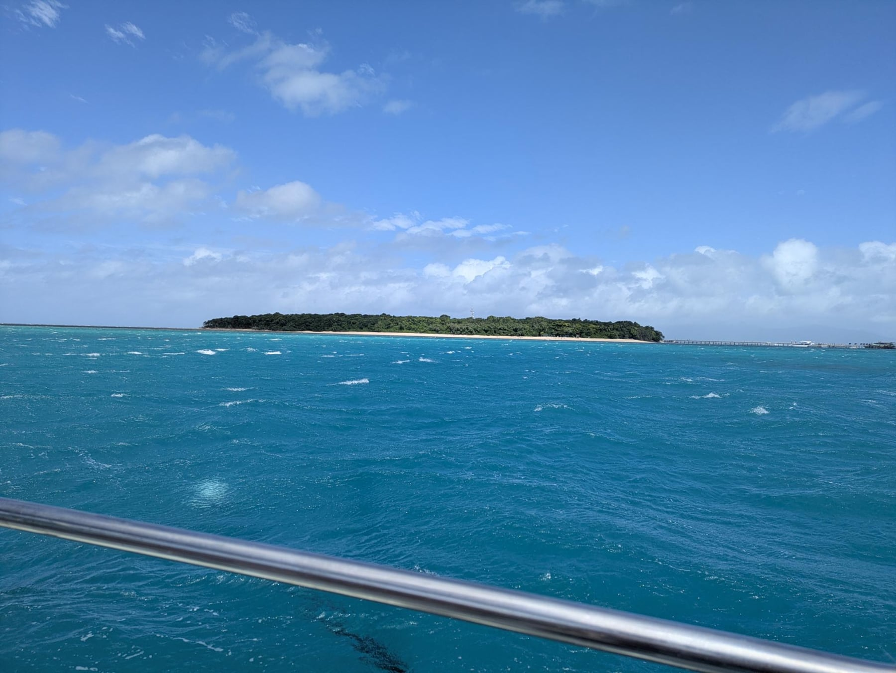
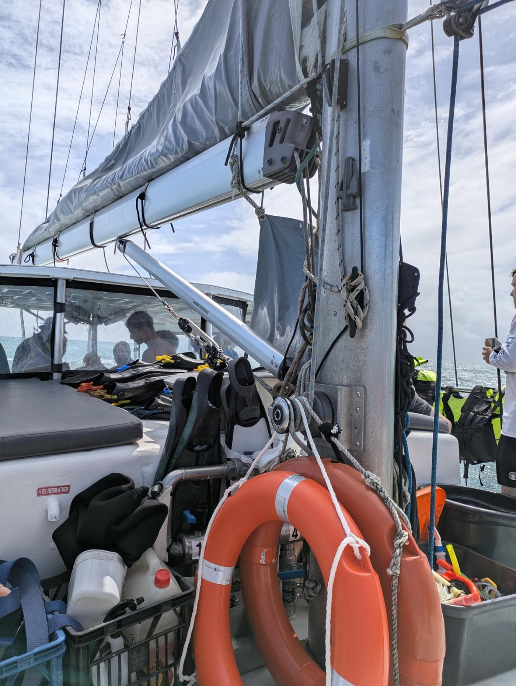

Today was the second worst day of my life.

It started off fine. I was still quite full from dinner last night but we went down to breakfast at 6 and ate a bit. I ate less than normal knowing we would have an entire day on the boat. We got our bags packed and headed to the boat. Check in was super quick since we already filled out the forms online. When we were boarding, the skipper Mike asked if we had checked the weather as it was supposed to be quite windy today. Shelby and I joked that it was good sailing weather.

We got on the boat and they offered us pastries, fruit, coffee, and tea. The crew was very nice. Three of them and the captain. My name wasn't on the manifest, so they quickly fixed that. We had 17 total people. We departed and while leaving the harbor we talked to a few people. Lots of people from the states this trip. Two people were dispatchers for Southwest, which was really neat. A couple who lived in Chicago for 30 years and is now in Florida. A younger lady from Georgia.

On our way out there was a bit of a squall we were going to pass through. Most people decided to go into the back area which was sheltered, but Shelby and I and a few others stuck outside. We were going to get wet soon anyways. The rain started and Shelby got a little cold so she and everyone else headed under the canopy. I stayed out front since that's where I always am on the boat. I was getting splashed occasionally by the waves and the water was so warm. They said 28°C which is almost 83°F. Any water that splashed was super warm. I've never felt ocean water like that before. And it was insanely blue. Beautiful water.

Shelby joined me again and we were the only two crazy people to sit out front and enjoy the splashes. I taught her how you can't predict which waves are the bad ones and which ones do nothing. The ones that splash and bounce you the most are the least expecting ones. She didn't get seasick at all after taking an ungodly concoction of medicines before we left. We saw a weird fish and some dolphins on the way to Green Island.

{.inline}

We got to the mooring and the wind was blowing a steady 30 knots. Probably 1-2 foot seas just where we were. They gave us all of the scuba instructions and suited us up in the wetsuit, life jacket, fins, goggles, and snorkel. We were the second group in the water. It was super warm, and they had a long rope extended out for people to hold onto to get their bearings. Shelby immediately was struggling but seemed to be fine when the tour started. I was struggling breathing through my mouth instead of my nose. And the snorkel was useless for me. I tried it a few times but any amount of salt water in my mouth made me gag. The water was significantly more salty than the ocean water I'm used to.

So we start our tour and at first I'm swimming on my own but it's too hard. Shelby has been holding on to a life ring that the snorkel guide was pulling along with him. Without it she wouldn't have made it as long as she did. I tried to look down occasionally but between the 2 foot waves, the wind, the mask, breathing, and trying to stay afloat, it was too difficult. I did see some coral a couple of times which was cool. Shelby said the only way she was able to do fine is with the snorkel so she saw a lot more than I did.

After less than five minutes, we felt like we were being tossed all around but the boat stayed in the exact same place. There was a very shallow portion where the coral was just below the surface and I hit my knee on it. Coral hurts. I decided I couldn't do any more. It was not enjoyable at all and felt like continuous drowning. I swam myself back to the boat and got out quite quickly.

Looking down at everyone else, nobody seemed to be having a problem. It really didn't look as bad from the surface. The looks were deceptive. The guy on the boat gave me a towel for my scrape and some antiseptic. Within a minute or two a bunch more people including Shelby were back on the boat. Within 10 minutes everyone was on the boat. Nobody had a good time snorkeling and they were all struggling in the water.

I immediately got sick. Too much salt water swallowed. Shelby helped me get my wetsuit off. I took a small sip of water and sat in the back. Within a minute I was feeding the fish. My stomach felt a bit better after that. They did serve lunch right after this but neither of us wanted to eat. A lot of people made a plate and took it to the island. Seven people decided they were not going back on the boat and took the larger and faster ferry instead. Smart.

We took the dinghy to Green Island and got soaked again. Remember the 2 foot seas? Also that dinghy had a 75 horse Merc on it, impressive. On the island Shelby cleaned up and got new clothes on and then we sat down and got a pizza and I got a burger and fries. The pizza and two Sprites was $39 AUD which is $28 USD. It wasn't good. My burger and fries was $40 AUD. Crazy. I ate the whole burger and fries, Shelby had half of the side of fries, the pizza wasn't great but we packed it up and wrapped it in a towel to take back with us for dinner later.

Mike comes and picks us up on the beach and we head back and of course get wet again. Trying to get from the dinghy to the boat is crazy when one second the dinghy is two feet above the boat and a second later it's two feet below.

Side note, we did sail both there and back as it was a sailboat which was cool, but remember that creates a lean on the boat.

So then we get underway. I start off in the back. It's stuffy in there. Right as soon as we left, we saw, as Mike said, 3.5m seas. That's over 10 feet. And in order to get the wind to put up the sails, we had to take them broadside. One time all of us on the port side get tossed to the starboard side. Ouch. I wasn't having that. The lack of air was making me sick. So I moved up to the front. On my way the sunglasses went right off my hat and into the drink. Oops. Shelby was mad. I told her, it happens.

The next two hours were the longest time of my life. Land didn't get closer. The seas didn't get better. No position I took on the bow made it better. I ate my burger 10 more times and some of the fruit they had served us. The boat was horizontal, then vertical, so I was horizontal, then vertical. I kept getting splashed and was freezing, but honestly it was a distraction from my stomach. We had over 5 foot seas for at least an hour and a half of that two hours.

I considered a few times if drowning was better than seasickness. When I talked to Shelby later, she said she made the same consideration. I was close to the water. My feet were basically in the ocean a few times when the side of the boat was in the ocean. It was fun, if I wasn't sick. Eventually it calmed down a bit. Halfway through I realized I was going to be burned, but I decided being burned was better than being even more sick. I might regret that later, but I made that decision. I went in the back and mentioned to Shelby that I am never eating again. 10 minutes later I was having some fruit.

Finally we made it to shore and the last little bit was calm. Getting off the boat was easy except we had to grab all of our stuff and the pizza which was now damp and wet so it went right into the garbage.

We made it back to the hotel and took showers immediately. Went to the chemist and got some antiseptic for my cut and some ice cream. That was dinner.

The Great Barrier Reef is beautiful. I saw it briefly. But the day I saw it was the worst day to be on a boat in Cairns, and I would not wish that experience on anyone. If you go, check the weather. If they say it's going to be windy, believe them.
