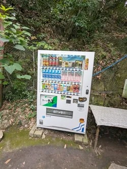
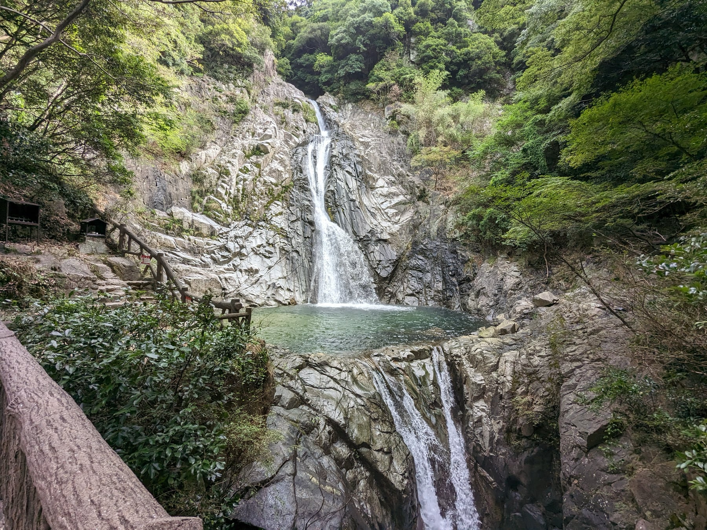

This is a collection of some things we did in Japan. It's not an itinerary, just things we thought were cool and suggest trying if you have time.

## Food and drinks

Go to 7-Eleven all the time. You WILL go here multiple times a day even if you don't believe it right now. Snacks, drinks, full meals, it's all good. This is not American 7-Eleven. FamilyMart is great too.

Vending machines are everywhere. Our first day we stopped at every one we could find and tried everything. Just do that.

{.inline}

[Nakau](https://www.nakau.co.jp/en/) is a cheap ticket-counter restaurant. Delicious. We went three times.

Department store food floors are great. [Yodobashi](https://g.co/kgs/eJykLF5) is technically an electronics store but has food at the top floor. We spent a ton of time just walking through the whole building and had dinner there once too. Worth checking out, and this applies to pretty much any department store.

Desserts in any of the train stations. Get lost in Tokyo Station. Buy a bunch of desserts at Kyoto Station. There's shopping and food all over these places.

[Melon bread at this place](https://maps.app.goo.gl/gcdjWYpYXLfodbzw7) in Asakusa. So good.

[Nakiryu](https://guide.michelin.com/us/en/tokyo-region/tokyo/restaurant/sosakumenkobo-nakiryu) is a Michelin-starred ramen spot. We missed it and regret it. Multiple people we know have gone and say it's incredible. Arrive very early. This is the one actual must-do on this list.

[Wakkoqu](https://www.wakkoqu.com/home/en) in Kobe for Kobe beef. We went to Steakland instead and wish we had done this one.

Krispy Kreme. Better quality than the US. Delicious and fun.

## Places

[Kinkaku-ji](https://g.co/kgs/NJFH2JQ) (the Golden Temple).

[Kiyomizudera](https://g.co/kgs/dVbQDPs).

[Fushimi Inari Shrine](https://en.wikipedia.org/wiki/Fushimi_Inari-taisha). Cool at sunset, great walk.

Higashiyama District for shopping in Kyoto.

[Kyoto Tower](https://g.co/kgs/kvkJjft). Cheap and quick.

[Tokyo Skytree](https://g.co/kgs/MDcp2iN). We didn't do it but everyone says to.

Shibuya Crossing.

[teamLab](https://www.teamlab.art/e/tokyo/) in Tokyo.

[Mount Hiei](https://en.wikipedia.org/wiki/Mount_Hiei). Cool cable car, really nearby.

[Nunobiki Falls](https://g.co/kgs/tj1h1Ni) in Kobe. Nice hike.

{.inline}

[Nankinmachi](https://en.wikipedia.org/wiki/Nankinmachi) (Kobe Chinatown). Fun to walk around.

[Itsukushima](https://en.wikipedia.org/wiki/Itsukushima) (Miyajima Island).

## Shopping

[Standard Products](https://standardproducts.jp/). Easy place to get super cheap house stuff or travel stuff.

[Yodobashi](https://g.co/kgs/eJykLF5) again for the electronics floors. Just fun to walk through.

## Cultural stuff

Learn the basics. Hello, thank you, goodbye, excuse me. It goes a long way.

They really do bow to everyone. Do the same, it's respectful.

They do not jaywalk whatsoever. Follow the signs and just overall do whatever everyone else does. Try to fit in.

Be open to trying everything!
