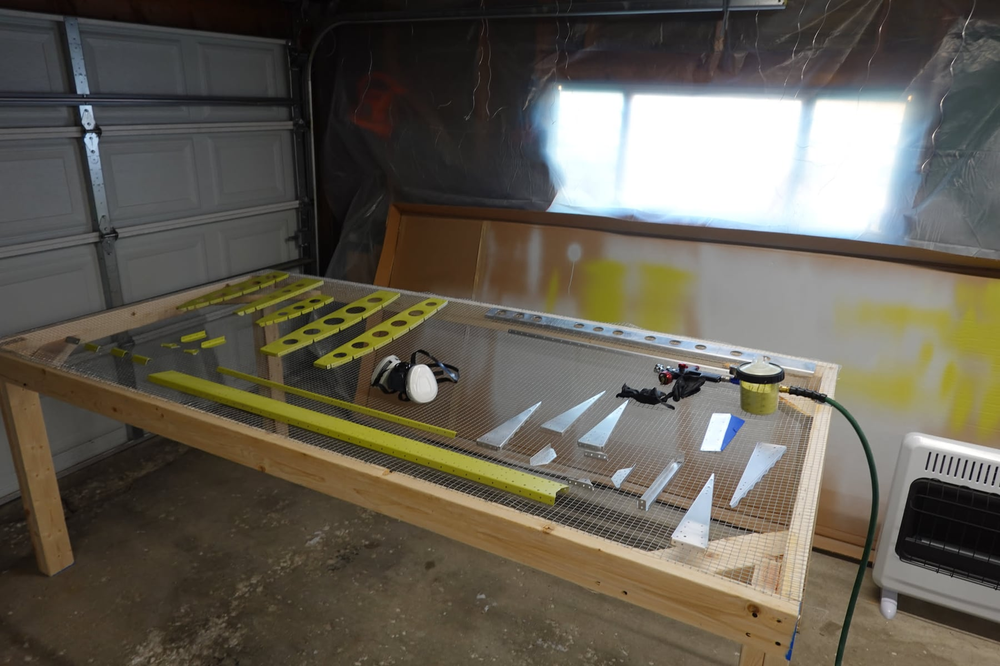
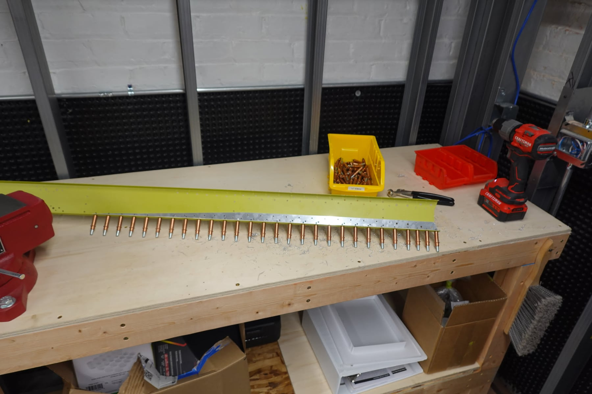
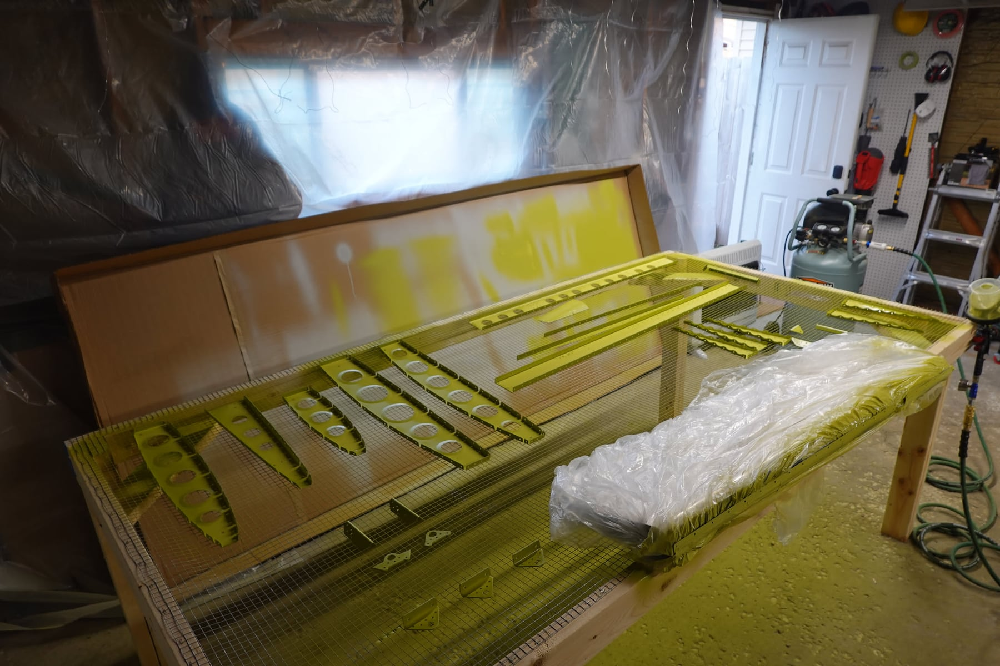

It's been a while since an update. Between the basement remodel, family
visiting, and flight lessons, the build took a back seat for a few weeks.
We're back in full swing now.

Another 6.5 hours for me, 8 hours for Shelby on the empennage. 36.5
combined so far.

## Kit delivery estimates

Vans provided estimated ship dates for the remaining kits: wings 5/7,
fuselage 5/19, finishing kit 8/4, and avionics 9/8. No estimated date for
the powerplant yet.

## LSRM course

Shelby and I signed up for Joby Aviation's LSRM course. It's about 10
weeks online followed by one week in person in California. Part of the
course is doing an annual inspection on an RV-12, and we also get Rotax
maintenance certificates. The in-person portion is in September, which is
good timing for installing the powerplant.

## Paint scheme

We contracted with Evoke for a paint scheme design. We talked with both
Scheme Designers and Evoke, and every time we saw a painted plane we
loved, it turned out to be an Evoke scheme, so that settled it. Not sure
who will paint it yet. I'd love Evoke for that as well, but they are quite
expensive.

## Build progress

The replacement left spar cap arrived and I quickly re-drilled the holes.
We deburred all the rudder pieces. The rudder skin took almost an hour and
a half on its own — it's too large for the scotchbrite wheel and the burrs
were pretty bad. Now that it's warmer out, Shelby set up a table outside
and did the EkoClean and EkoEtch out there.

I spent a good amount of time researching spray painting and dialing in
the paint gun. I built a priming table out of hardware cloth in about 45
minutes and it works great. 75 PSI on the regulator at the compressor and
25 PSI at the gun with the trigger pulled works nicely. Still dialing in
the paint and fan controls, but I'm a lot happier with the results. I
re-primed the vertical stabilizer pieces (after sanding with scotchbrite)
and all of the rudder internals. Definitely an improvement over last time.

We'll let these dry for two days and rivet things together Saturday, then
start the stabilator Sunday. I practiced squeeze riveting for the first
time and wasn't happy with the results. I need a lot more practice, but
the few I did might have convinced me to buy a squeeze riveter.

## Primer weight

I weighed two pieces before and after priming to see how much primer I'm
putting on. A rudder rib went from 21.9g to 23.9g (9.1% increase) and the
rudder spar went from 204.2g to 217.2g (6.4%). More than I expected — I
was thinking 3% max. Everything I read said to put on more primer and go
for a nice glossy coat, but maybe I'll dial it back a bit. Not too worried
about these pieces. Still learning.

## Photos

