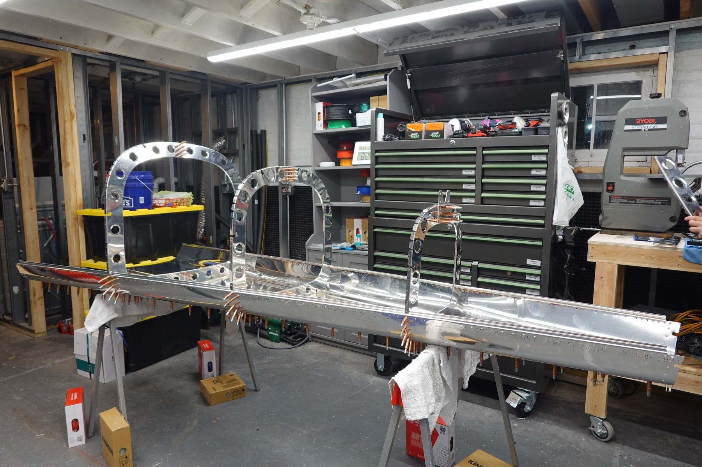
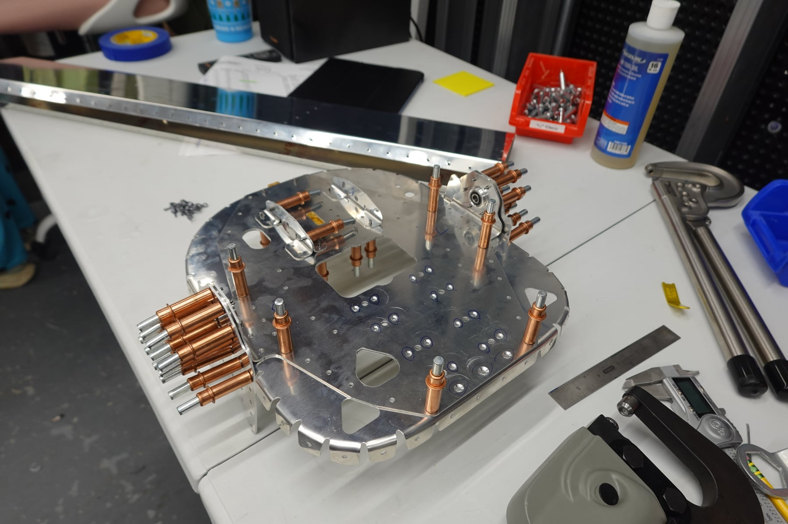
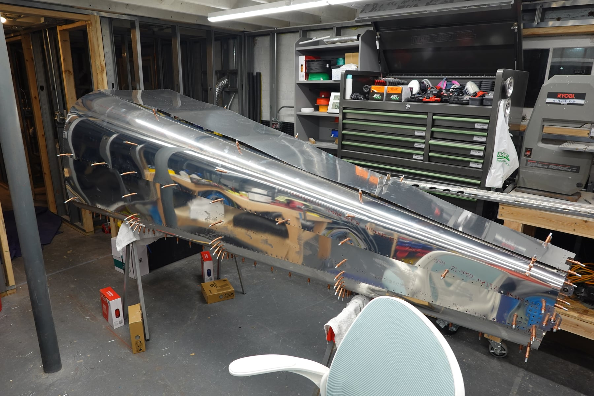
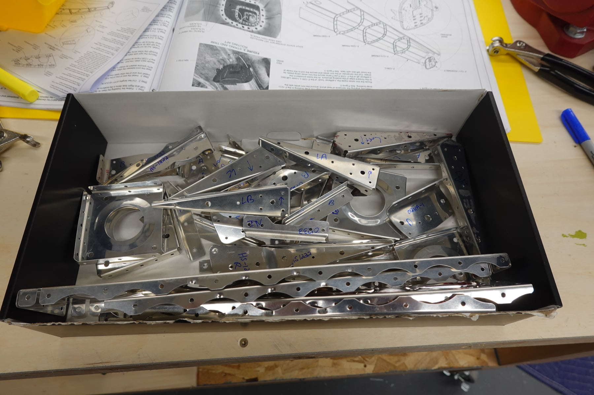
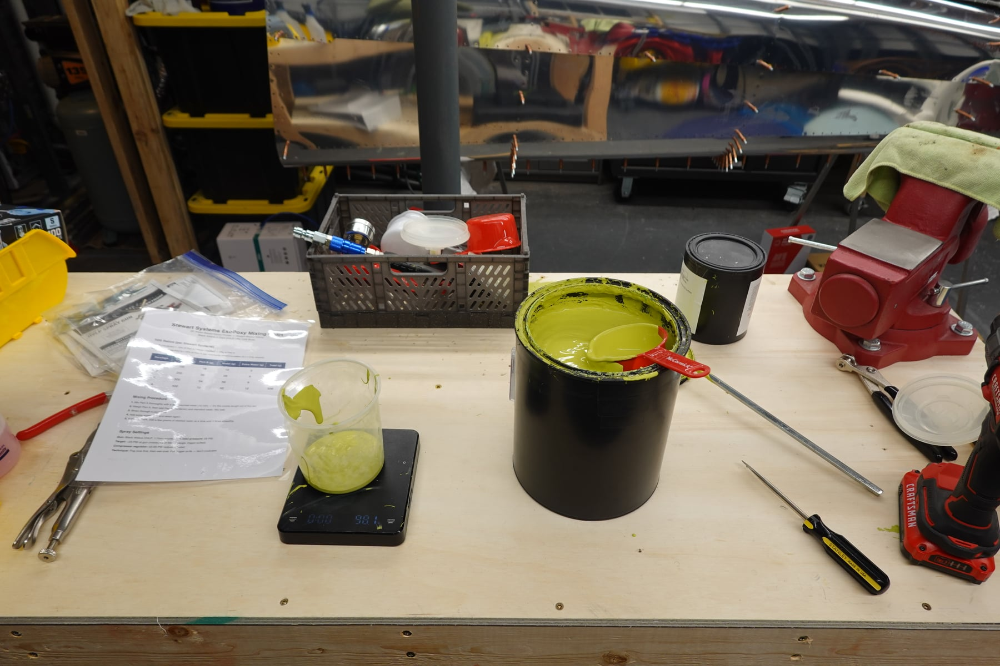
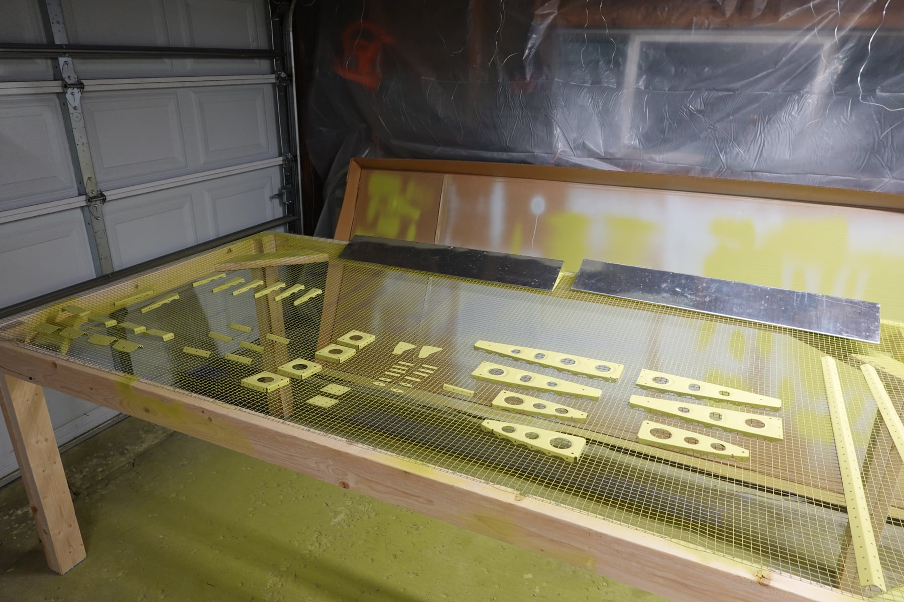

We've made a lot more progress. It doesn't look like much because we're
priming everything, but it's one more bite of the elephant.

## Our process

My process, broken down: first read through the instructions for a section
and get a general understanding. Then dry fit everything with clecos and
do the required match drilling and cutting. The goal is to have as much
assembled with clecos as possible so any part modifications are complete.
Make sure everything is labeled for re-assembly. Disassemble, deburr,
clean with EkoClean, etch with EkoEtch, prime. Cure at least 48 hours.
Then go back through the instructions and rivet. It feels like double the
work, but there's an advantage: I've found a few mistakes after clecoing
(past the point where I was supposed to rivet), and since it's just
cleco'd, I can fix them.

## Rudder

I started riveting the rudder, but made a mistake. I didn't like how the
rib connected to the rudder horn. Not enough clecos during riveting left
a gap, and after drilling it out I wasn't happy with the piece anymore,
so I ordered a replacement. Finishing the rudder won't take long once it
arrives.

## Stabilator

I dry fit a majority of the stabilator; it's ready for deburring and
priming. I have to admit a brutal mistake here: when fluting the ribs I
used too big a fluter and cracked four of them. All four needed replacing.
A careless mistake, lesson learned. At least I haven't made the same
mistake twice yet.

## Tailcone

We also dry fit most of the tailcone. This one was fun because it really
looks like an airplane. Everything fits and is match drilled, so soon it
gets disassembled and prepped for priming. I'll get more of the ASTs and
stabilator done first so the queue doesn't get too deep.

## Timeline

We have a soft deadline to finish the empennage: we're going on vacation
in May, and want it done before we leave, because when we get back the
fuselage and wings should be waiting. I think we'll make it.

## Photos

