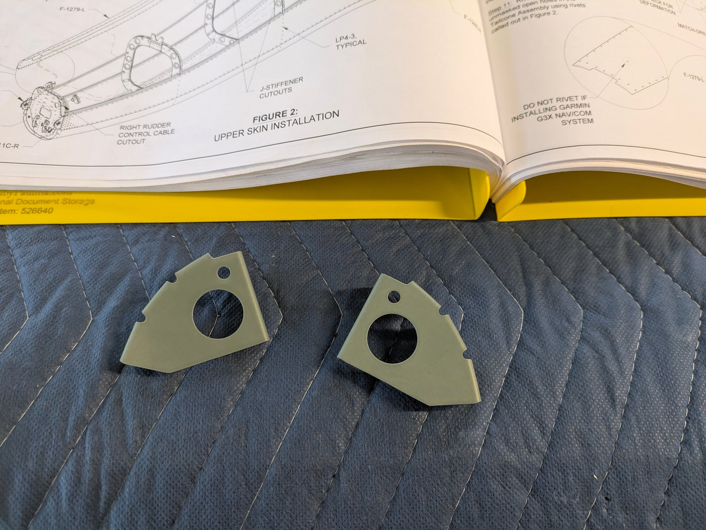
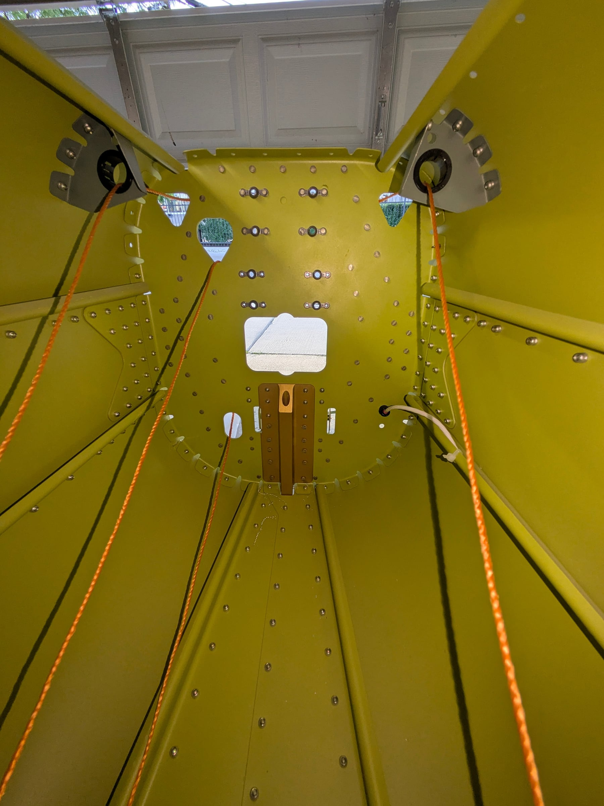
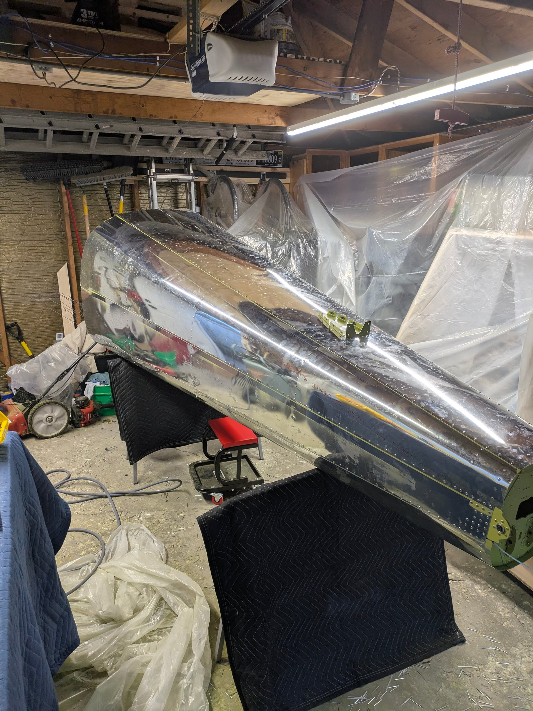
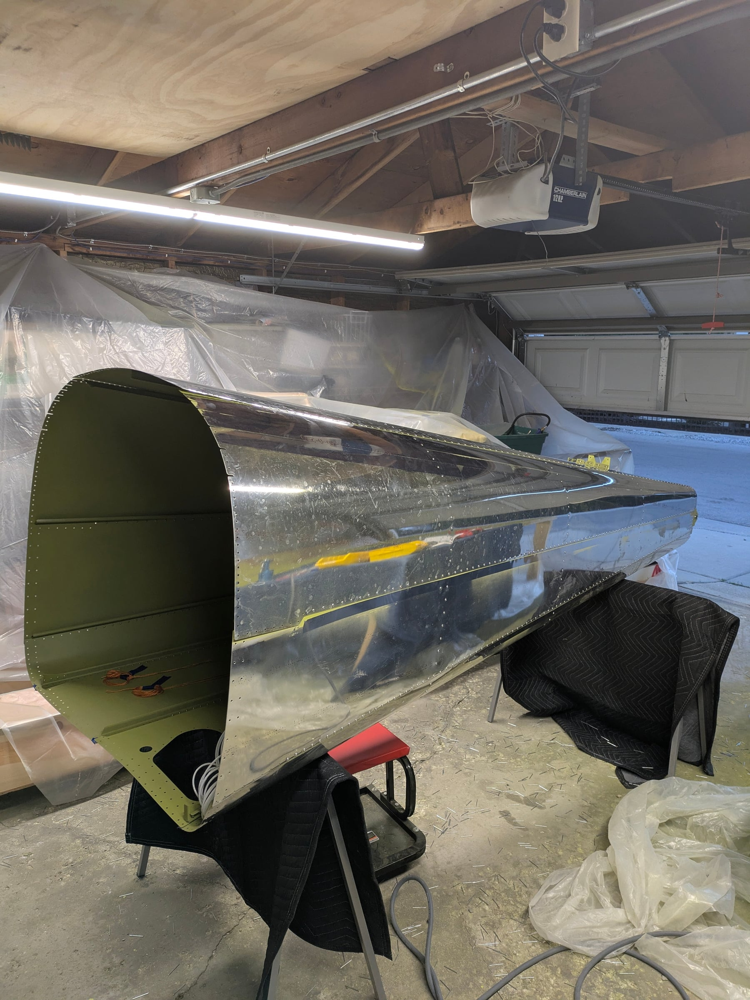
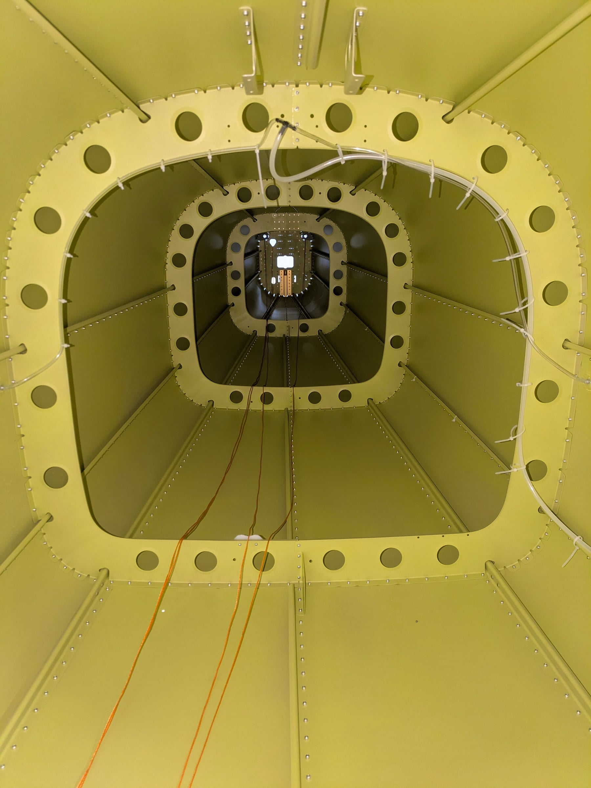

The empennage is done! Well, mostly. There's about an hour left on the
stabilator fairing, and I'm saving the VS and rudder fairings and all the
mounting hardware for final assembly, since the empennage won't fit in my
garage assembled and needs to stay in pieces until it moves to a hangar
toward the end.

Total combined empennage time: 167 hours. 74 for me, 93 for Shelby.

## SEM primer for stragglers

Two pieces didn't make the big priming session: the rudder cable snap
bushing brackets. Since they're just brackets, we cleaned and etched them
and sprayed them with SEM self-etching green rattle-can primer. It's not
the same as the EkoPoxy, but they're hidden away, nobody will ever see the
color difference, and at least they're primed. We might do that for other
single pieces that aren't worth mixing a whole batch of EkoPoxy for.

## What's next

Time to make room in the garage and start on the wings! We have some plans
over the next three weeks, so an earnest start might not come until early
July. Then all of July and August are free to work on them.

We're also having our tech counselor over soon to look at our work and
make him some dinner. Hopefully all goes well there.

## More money to Vans

On the bittersweet front, Vans messaged today asking for the final deposit
on the finishing kit. Just when I thought sending them $37k was enough,
they want $16k more. The kits are going to pile up in the garage faster
than we can assemble them. On the bright side, we get to visit Flightline
Interiors soon and pick out all the special details. Now that the paint
scheme is done, it should be easier to make everything match.

## Photos

