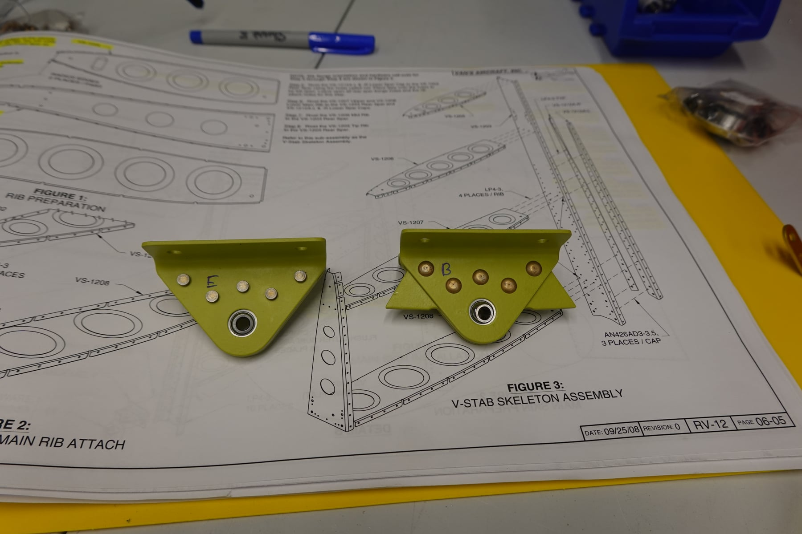
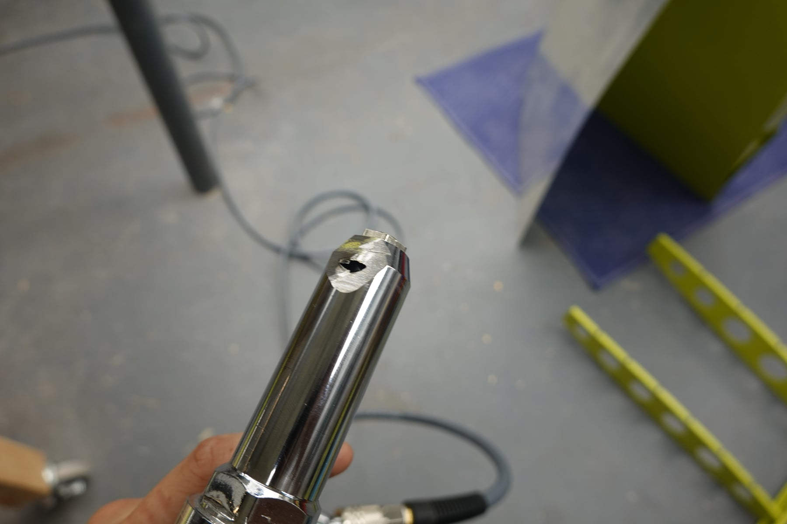
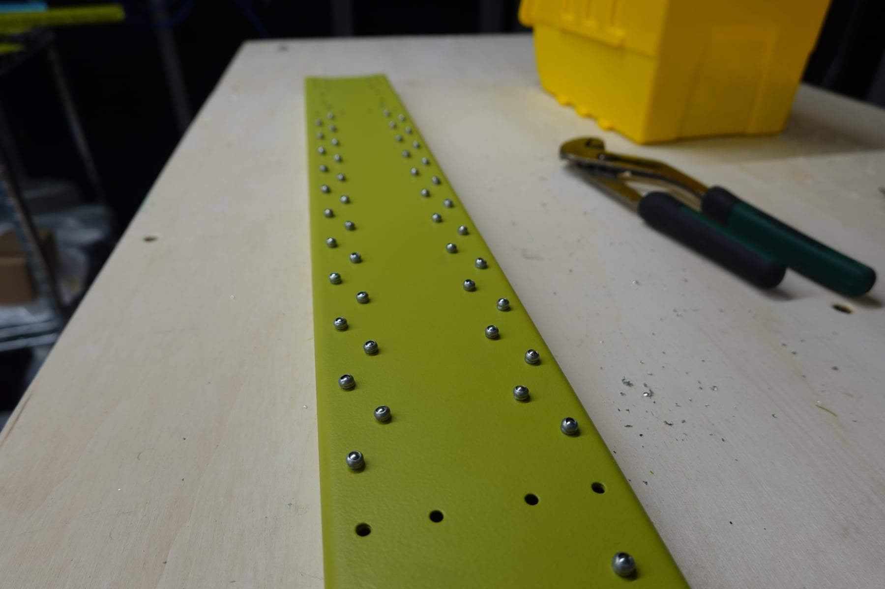
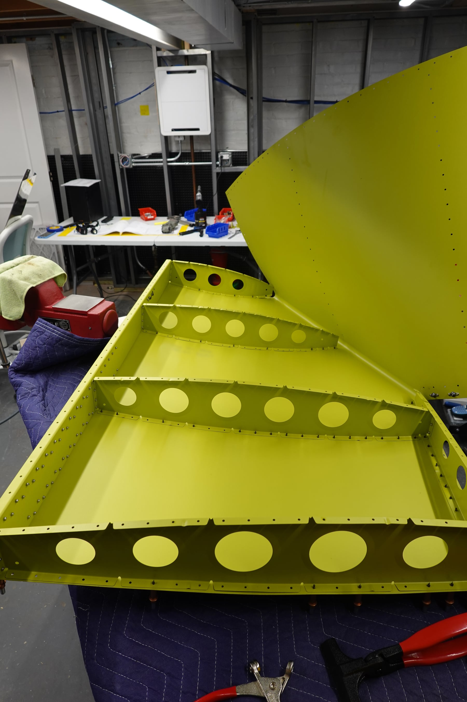
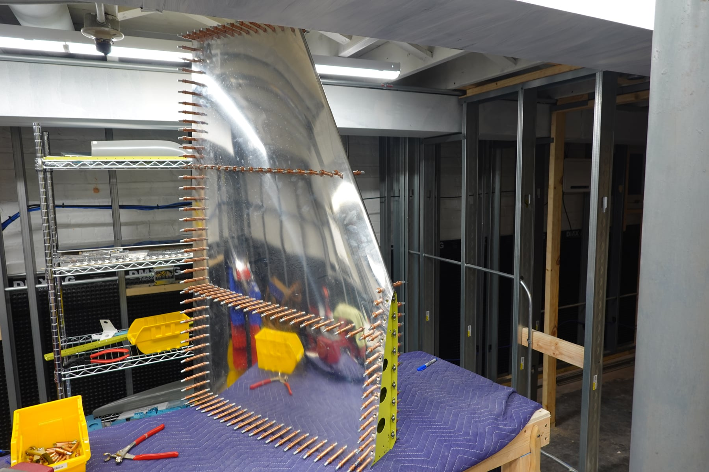
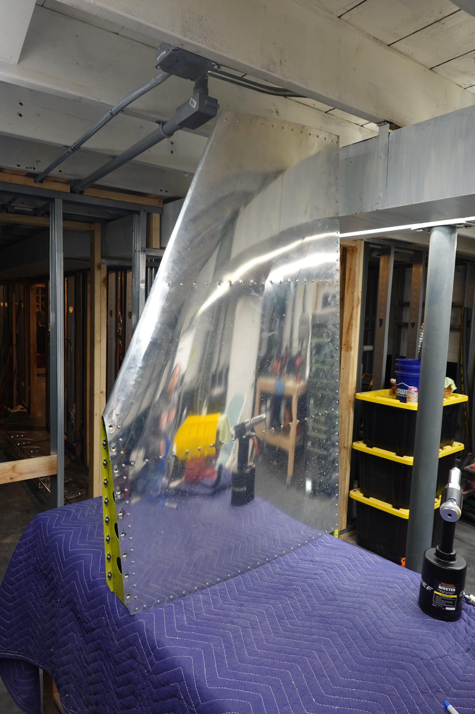
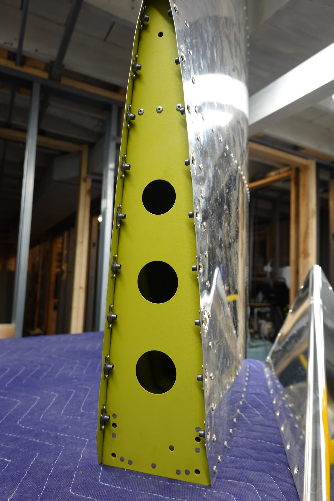
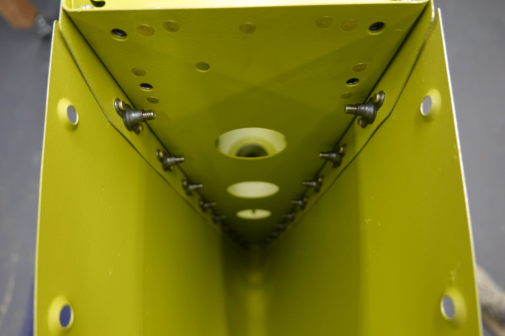
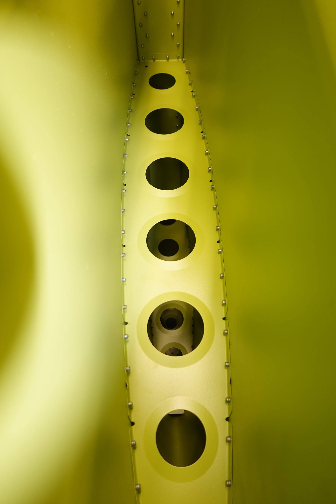

Another 5 hours each on the empennage.

## Mistakes happen

We started the dry fit for the stabilator and I messed up a piece
(HS-01233, Stabilator Horn Attach Angle). The plans say to be extra
cautious drilling. I thought I was cautious enough, but apparently not,
and I elongated the hole. Oops. There's another $27 for a replacement.
The part itself is always cheap — it's the $15 minimum shipping that makes
it expensive.

## First rivets

We finally started riveting! We ended up buying the pneumatic squeezer
from Aircraft Tool Supply. It arrived missing the ram; ATS sent a
replacement that showed up the next day. The pneumatic squeezer makes
things so much easier — I would not want to squeeze all these by hand.

## Vertical stabilizer complete

We riveted the entire vertical stabilizer, and honestly it went pretty
well. Getting the skin to fit without forcing it was the hard part. If I
did it again I'd do a better dry fit before priming, because we had to
file more off the edges to get the skin on without too much pressure.
It's fine — just not as pretty inside as it could have been.

I also had to grind away part of my pull riveter to get it to work with
the wedge tool. Tool modification #2 so far; I'm sure there will be more.
Shelby was definitely concerned when she saw me taking the belt sander to
our perfectly good riveter. She's laughing as I type this.

The vertical stabilizer is done! Rudder next. Shelby says building a
plane is just cleco, uncleco, cleco, uncleco, and so on. She's not wrong.

## Photos

