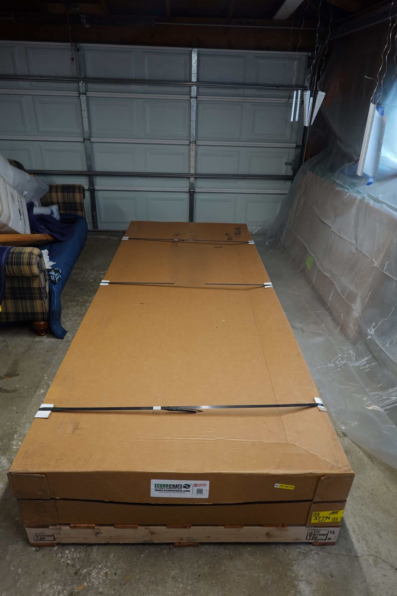
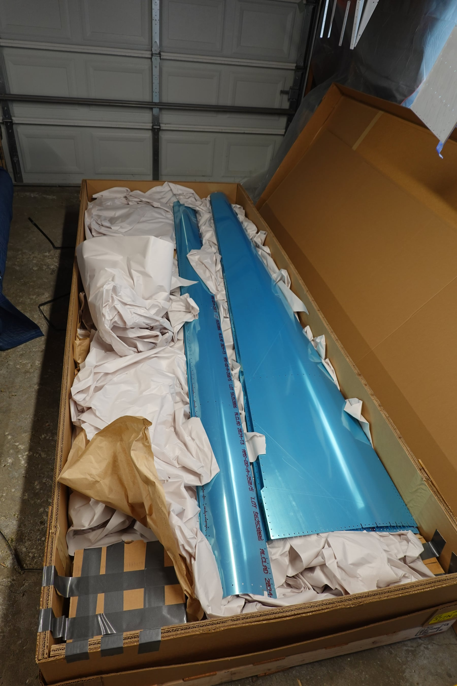
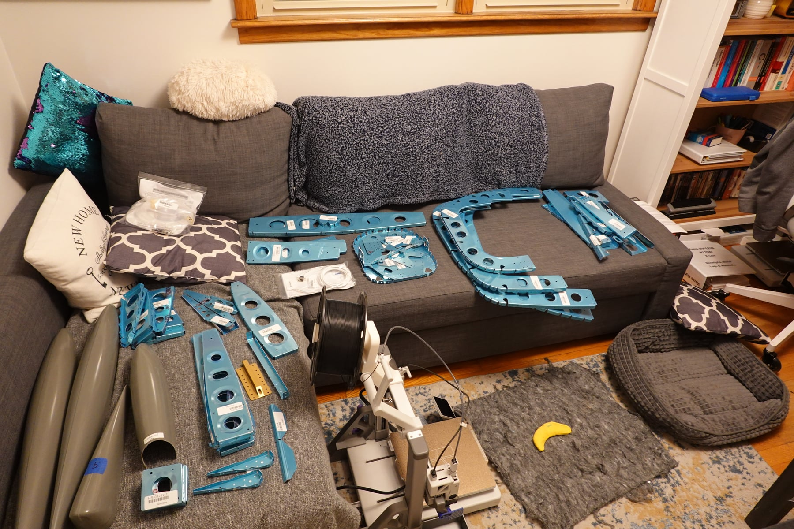
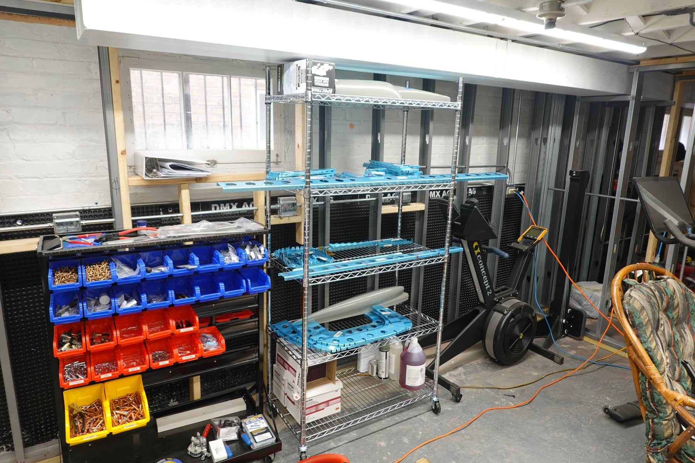
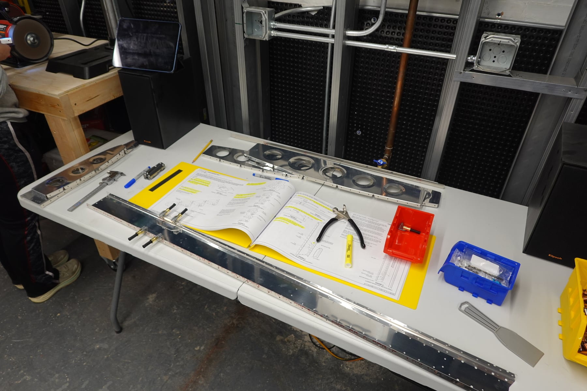
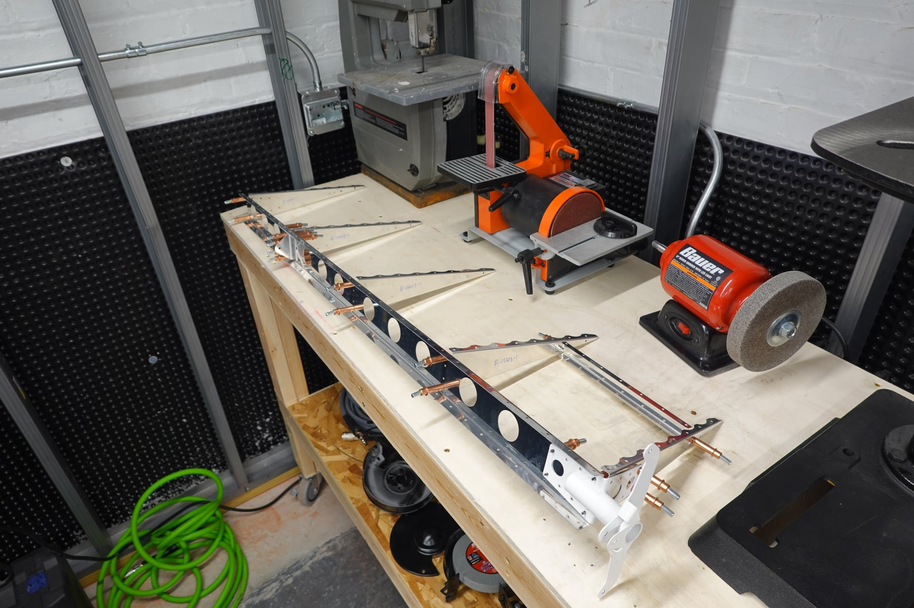
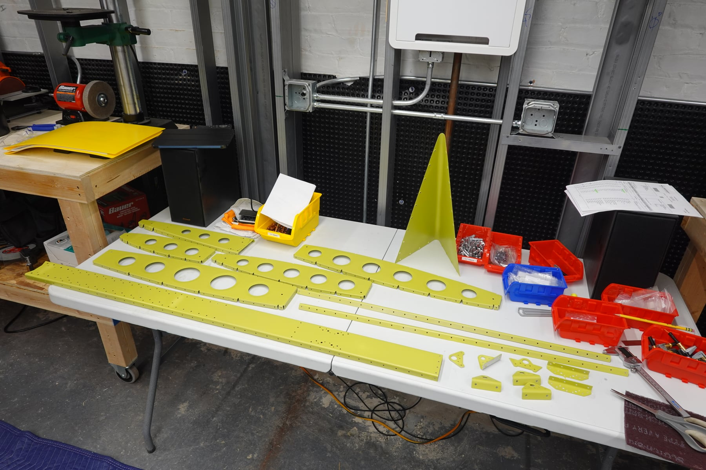
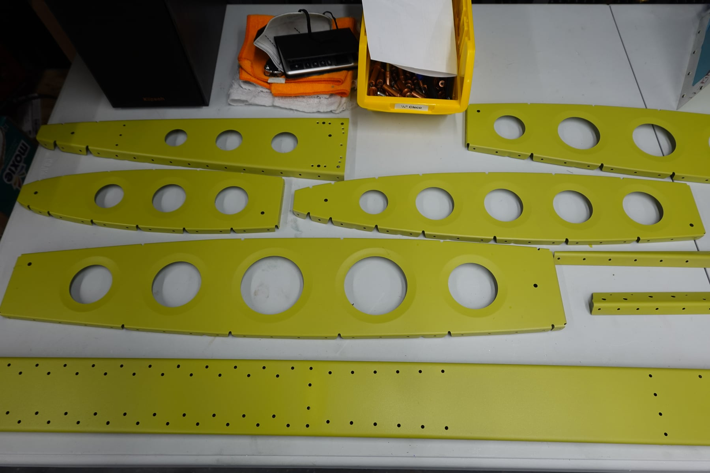
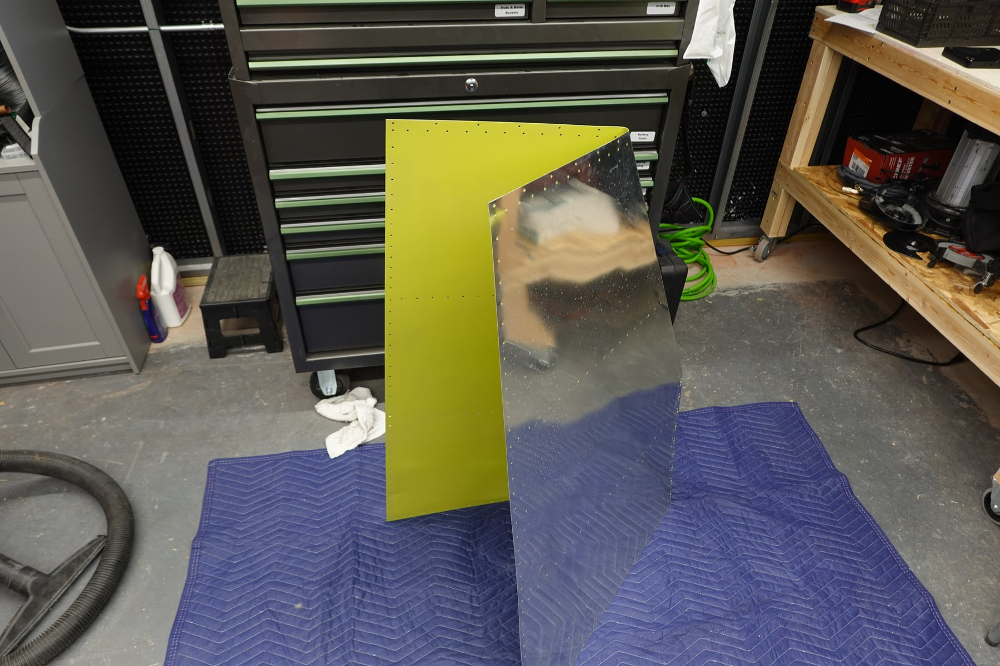
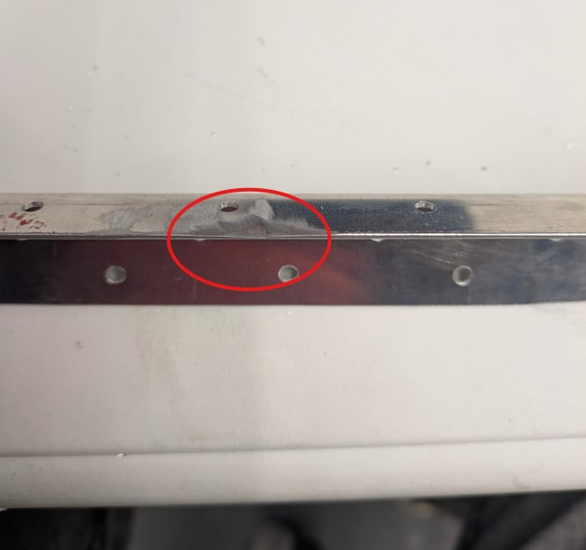

## Kit arrival

The empennage arrived on Thursday, February 26. Pretty quick shipping from
Vans. The kit tracker estimated it would ship on 2/12 and I got the ABF
Freight pickup email on 2/17. Shipping came to $947.

I was expecting a wooden crate like in the various build videos, but Vans
now uses a cardboard crate on a wooden pallet for this kit. We opened it
up and inventoried the whole thing Thursday night. It didn't take as long
as expected, and we were only missing one bag of electrical connectors.

## First weekend: vertical stabilizer

On Saturday we jumped right in on the first section: the vertical
stabilizer. I cut, drilled, and fit everything together while Shelby
deburred. We made a couple of small learning mistakes on the first few
pieces and may replace them, still debating. Some of our initial
deburring was too aggressive on the rudder mounts (we've already refined
that technique), and we accidentally nicked a long piece of metal when
deburring it into a different grinding wheel. That other wheel has since
been removed.

Overall our confidence grew as we worked through the vertical stabilizer
and I think it's turning out pretty good. Between Saturday and Sunday we
both put in around 11 hours each. We ended the weekend with all of the
vertical stabilizer parts primed and curing for assembly. I also fit and
drilled the rudder pieces, which are currently cleco'd in place. Next step
is getting those ready for priming too.

## Priming notes

Priming went okay. Not enough paint was coming out of the gun, even with
the flow completely open. It's going to take some fine-tuning, but I'm
sure we'll figure it out.

## Photos

