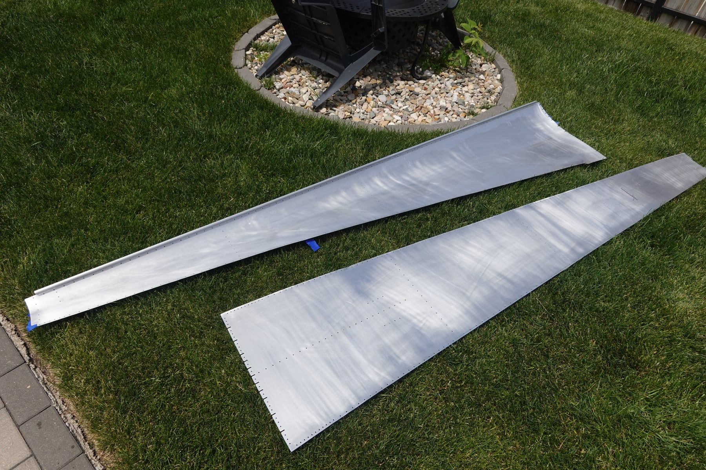
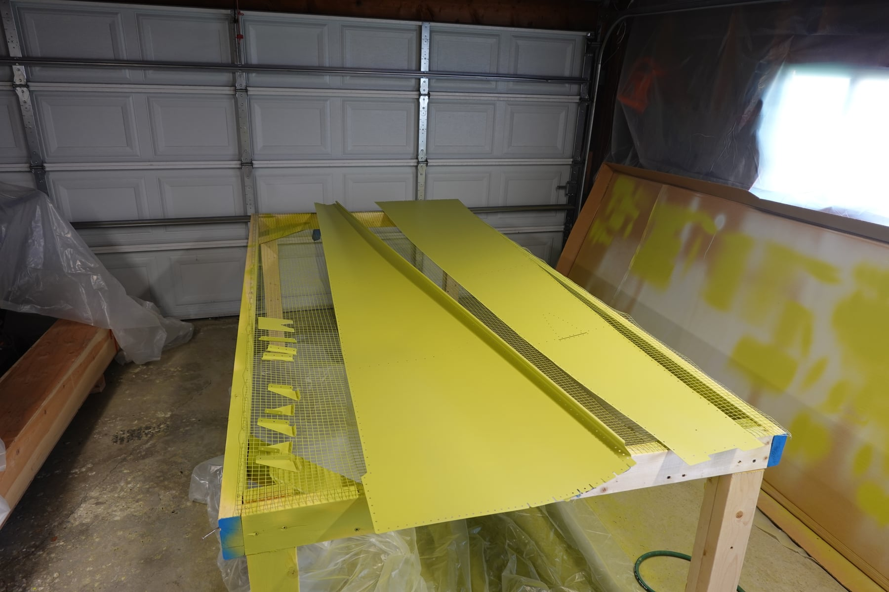
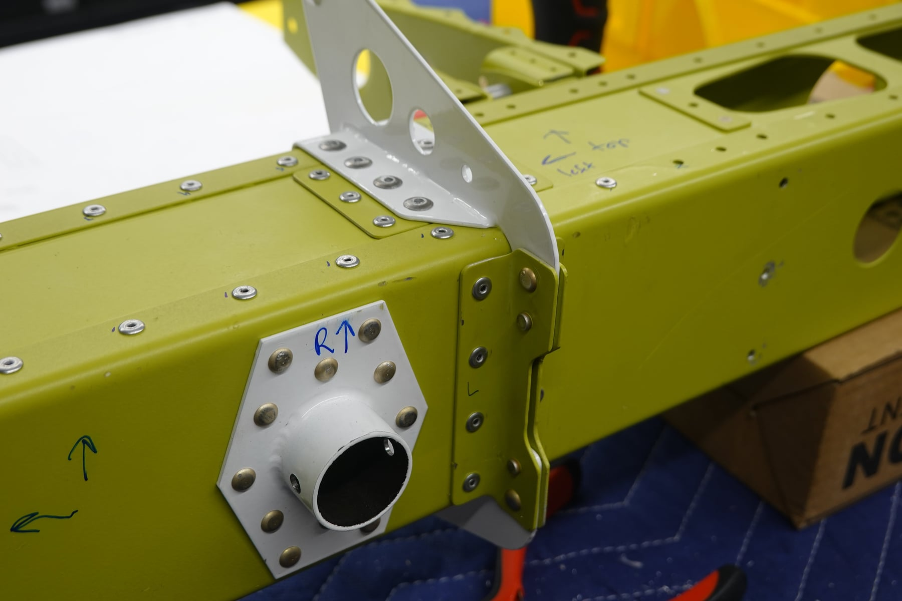
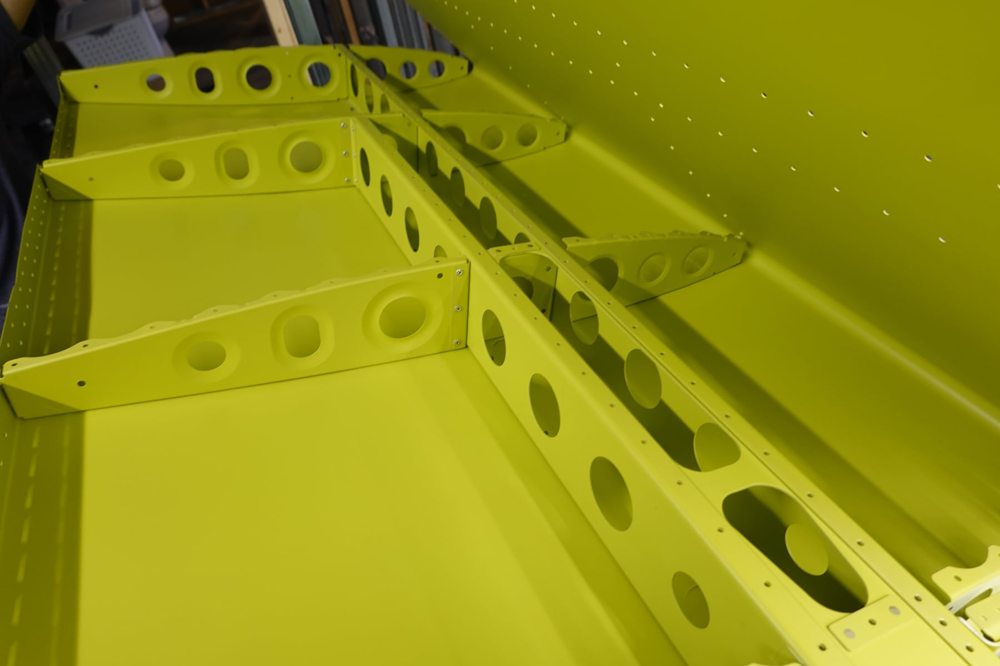
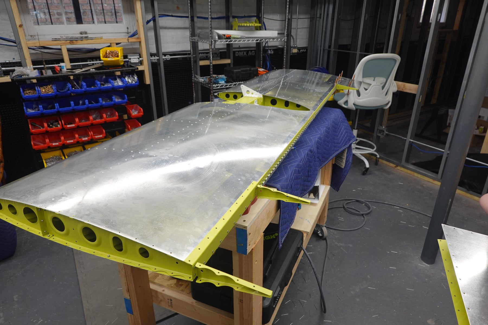

It's been over a month since the last update. Not much has changed on the
build, but a lot has happened.

## Flight training

We spent 11 days in Carson City, NV at Sport Aviation Center working on
our sport pilot licenses in Sling 2s. I completed my first solo flight,
which was obviously exciting! Shelby and I trained over 20 hours across
almost two weeks. Then we went on our pre-planned vacation to Australia —
22,000 miles and 40+ hours of flying, but as passengers.

## Wing kit delivery

We got back on Memorial Day and took delivery of the wing kit on May 26th.

## Stabilator troubles

Back in late April I started riveting the stabilator and had a lot of
trouble with the rivets for the upper and lower horn doublers. The body of
the squeezer was in the way, making it really difficult to get a clean
set, and the hand squeezer doesn't work well on the 4-6 rivets. I tried to
make it work, but the rivets didn't set properly, and when I drilled them
out I enlarged the holes and wasn't happy with the whole area. So I
replaced the doublers, horns, and all the rivets. That caused quite a bit
of stress and frustration.

I ordered the replacement pieces (HS-01233, WD-01207-1-PC, WD-01208-1-PC,
and 24x RBSPQ-5-2). This is my second HS-01233 replacement. Future
builders: pay attention to this part and don't repeat my mistake. Vans
sent the order out, but it turned out they shipped two 01208-1 pieces (one
mislabeled as the other part), so I had to wait for the correct one.

So that's where we stood: a partially assembled stabilator waiting on
parts and a dry-fitted, mid-deburring tailcone, with most of April and May
spent away.

## Back in the shop

This weekend we're back in full swing. We re-drilled the doublers very,
very carefully — both of us were nervous. Since we had to prime them, we
got a couple of tailcone pieces ready for the same batch. Then we finished
riveting the stabilator assembly. Done!

## Tip: stabilator horn doubler rivets

The body of the pneumatic squeezer gets in the way when setting the rivets
on the horn doublers. It does work, but it's difficult and the set isn't
perfect. Due to clearance I set the top and bottom rivets from one
direction and the two middle rivets from the other — two from the right,
two from the left. It looks a bit inconsistent but it's functional. Take
your time on these and be prepared for it to be stressful.

## What's next

Tailcone assembly moves to the garage — there's no way it comes out of the
basement assembled. The wings I'll probably assemble in the basement and
take them out when the contractor replaces the window, since I think they
fit through the window but definitely not up the stairs.

## Photos

