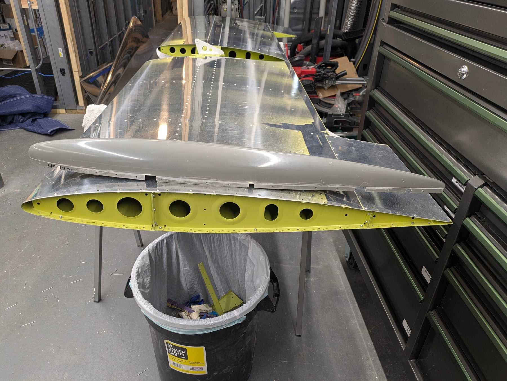
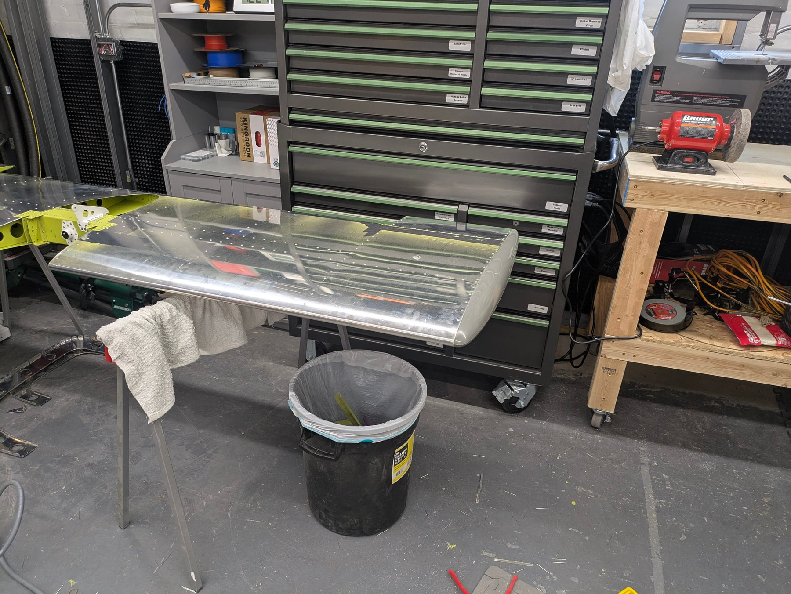

Another 13 hours combined this weekend (5.5 for me, 7.5 for the YL).

## Tailcone deburring

Almost all of our time went to deburring the tailcone. The pieces are very
large, and parts like the ribs have a lot of intricate edges. I hole
deburred every tailcone piece, and the YL is working through the edge
deburring. Since these pieces are too large for the scotchbrite wheel on
the bench grinder, she's settled on 220-grit sandpaper taped to a file,
plus scotchbrite and small diamond files.

Once I finished hole deburring (some by hand, some with the drill,
depending on what I felt like), I started on the fiberglass fairings for
the stabilator. Not the most fun job, not the cleanest job. None of my saw
blades liked the fiberglass, so I put on a mask, went outside with the
bench sander, and removed material with 80-grit. Then files to clean up
the edges and create the notches. It turned out okay — not the smoothest,
but when it gets painted I'm sure it will be filled, sanded, and cleaned
up.

## Powerplant shipping

Vans sent an email this week asking for $37k because the powerplant is due
to ship in July. Fun. At least the pieces are arriving — definitely faster
than we can assemble, which was the intention. I'd rather have everything
waiting for us than run into delays with nothing to work on.

## Weight check

A very experienced builder saw my primer posts and warned me I was using
way too much — "this airplane is going to be heavy!" That stressed me out,
so I ran the numbers. Vans quotes an RV-12iS with options at 775 lb.
Another builder with primer, paint, wheel pants, and dual IFR (similar to
ours) reports 800 lb.

So 800 lb seems about right as a baseline. A slightly heavier primer and a
more complicated paint job might add 25 extra pounds, and we're going with
all the interior options, so that's not unreasonable. I'm going to refine
my technique on the rest of the tailcone and wings and try lighter coats,
but I also want full coverage, and EkoPoxy seems to go on thicker in
general.

If we target sub-825 lb, here's the math: the two of us weigh about 280
combined, 75 lb of baggage, 20 gal of gas at about 120 lb — that puts us
at 1300 lb. Not sure about CG yet. That leaves 20 lb to spare, and with a
guest along we wouldn't have the 75 lb of baggage. Hopefully 825 is worst
case, but running the numbers alleviates my worries a bit.

## What's next

The goal is a riveted tailcone by next weekend. Finish deburring and prime
this week, assemble next weekend. This is where assembly moves into the
garage, which is already crowded since it doubles as the paint booth.
We'll figure something out.

## Photos

