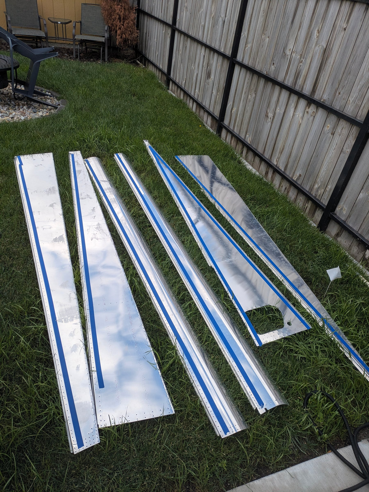
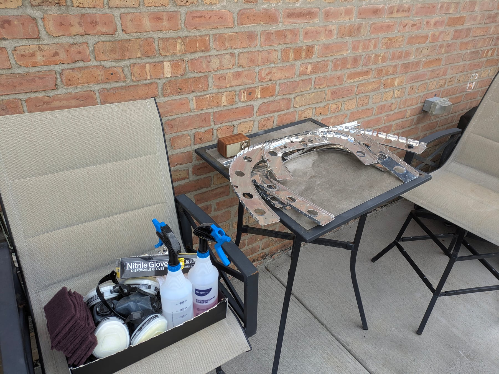
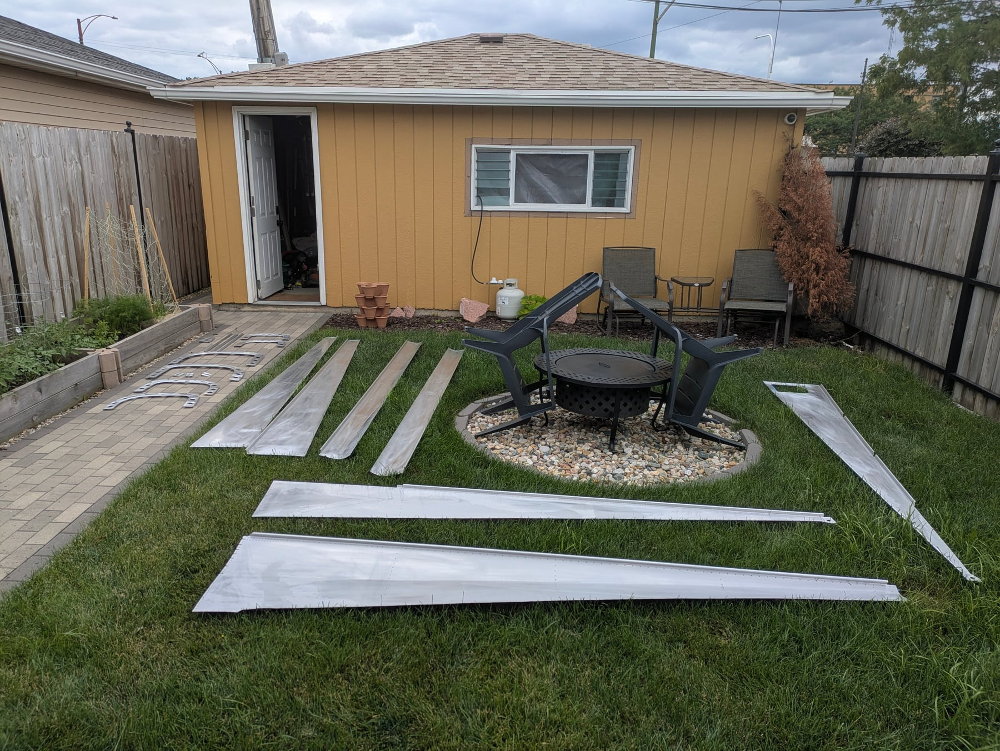
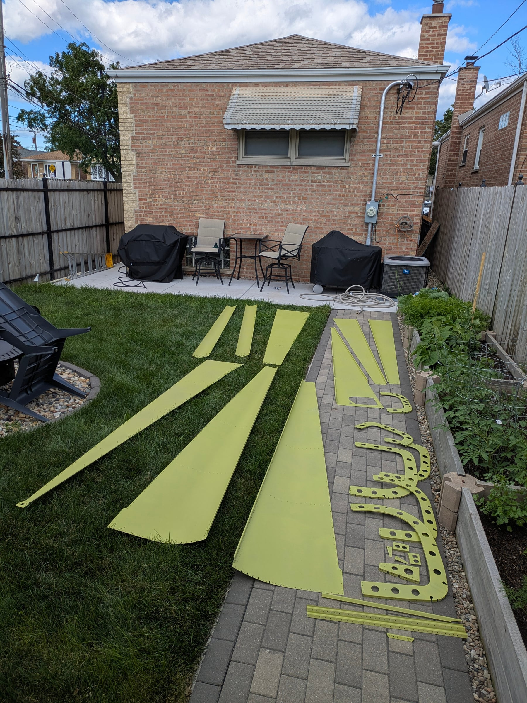
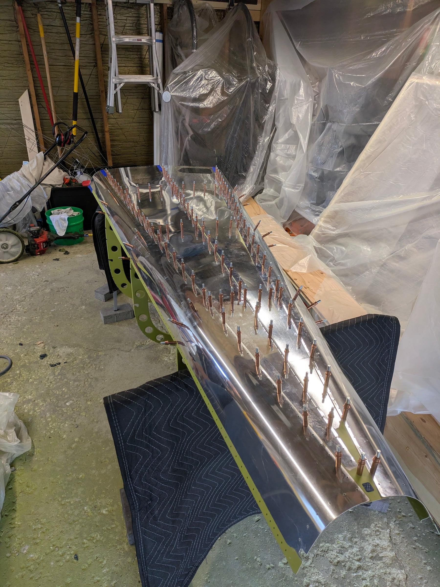
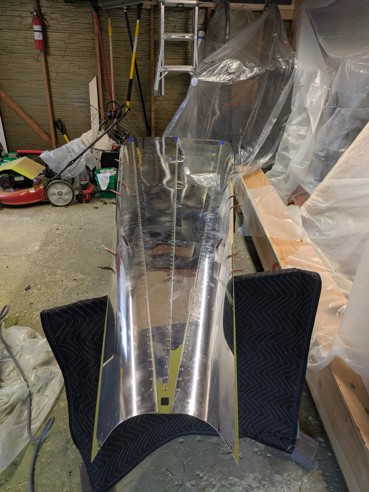
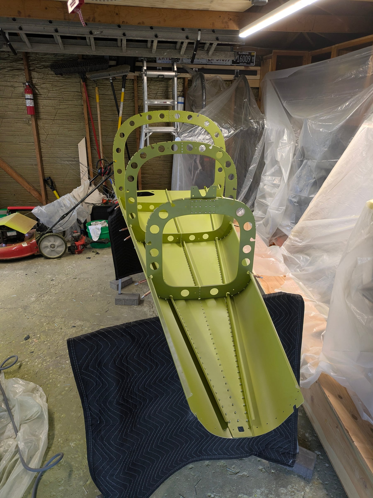
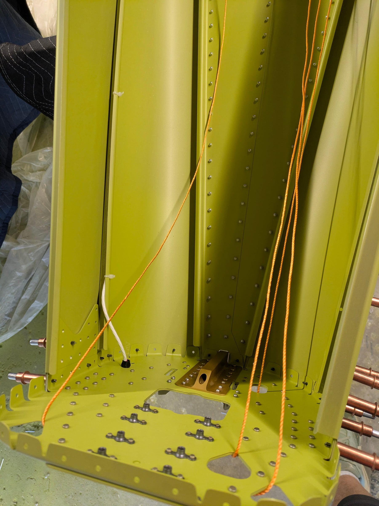
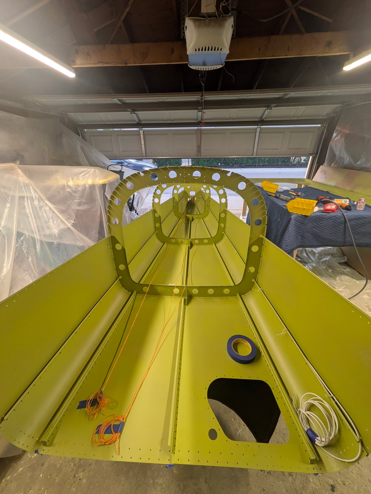

Another 23 hours combined this weekend (8 for me, 15 for the YL). She
almost lapped me in hours with all the deburring.

## Deburring, cleaning, etching, priming

We finished deburring all the tailcone pieces, brought them outside,
cleaned and etched them, then primed. I did a lot better with the priming
this time: less than 400g of primer for all of the tailcone pieces, and
probably 100g of that was lost to overspray and dialing in the nozzle. So
roughly 300g actually on the parts. Definitely a better rate than the
empennage sub-assemblies.

## Riveting

Then we started riveting the tailcone together. It's going quickly now
that we've found a good process. We stopped right before installing the
static system since I need to find some RTV sealant. Good progress this
weekend — more during the week.

## Photos

