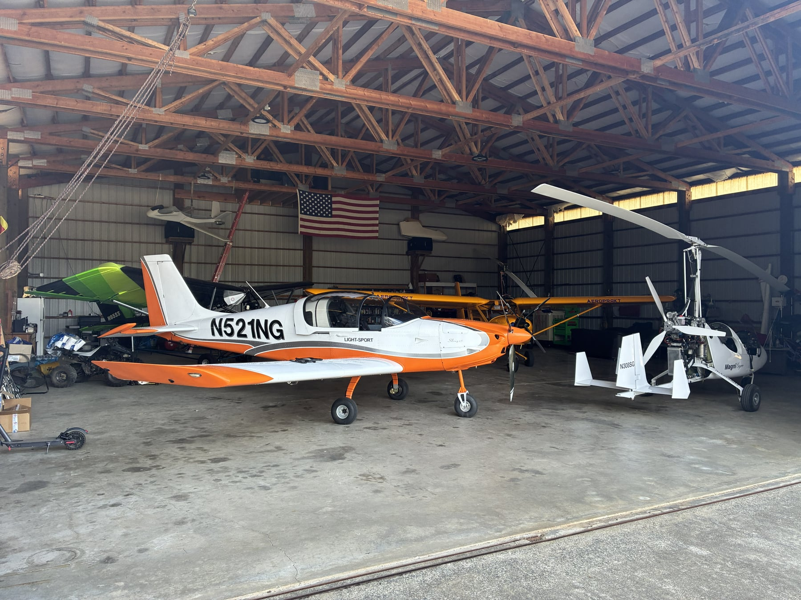

As promised, it's been a while. No building progress. The wings are still
ready to be started, and that's the goal this week. I'm finally back home
and settled, and while we haven't built anything, there's been a lot of
progress elsewhere.

## Sport pilot checkride

Most importantly, I passed my sport pilot checkride this past weekend! Now
I'll actually be able to fly the plane we're building. Happy to be done
with that process after three flight schools, 72.3 hours, and a 300nm XC
flight from Nevada to Oregon to actually complete the checkride. Big
thanks to Paul and Michaela at Sport Aviation Center in Carson City, NV
for the majority of the training in their Sling 2s. They do a great job.
Also thanks to Wolf at Captain Drake's in Cave Junction, OR for doing the
checkride. It was a lot of fun, and I can't wait to take the finished
RV-12iS out west.

## Costs

I got another email from Vans asking for another $35k. Thankfully this is
the last one. We're sitting at $175k total spend. Only outstanding costs
are some kit shipping (est. $3k), painting, fluids, and whatever
replacement pieces or tools I need along the way.

## Fuselage delivery

The fuselage kit is being delivered on Monday. I have no idea where I'm
going to put it. I need to build the wings in the garage, and my coat
closet is already full of wing skins. I guess I'll find more closet space
throughout the house to store extra airplane parts.

