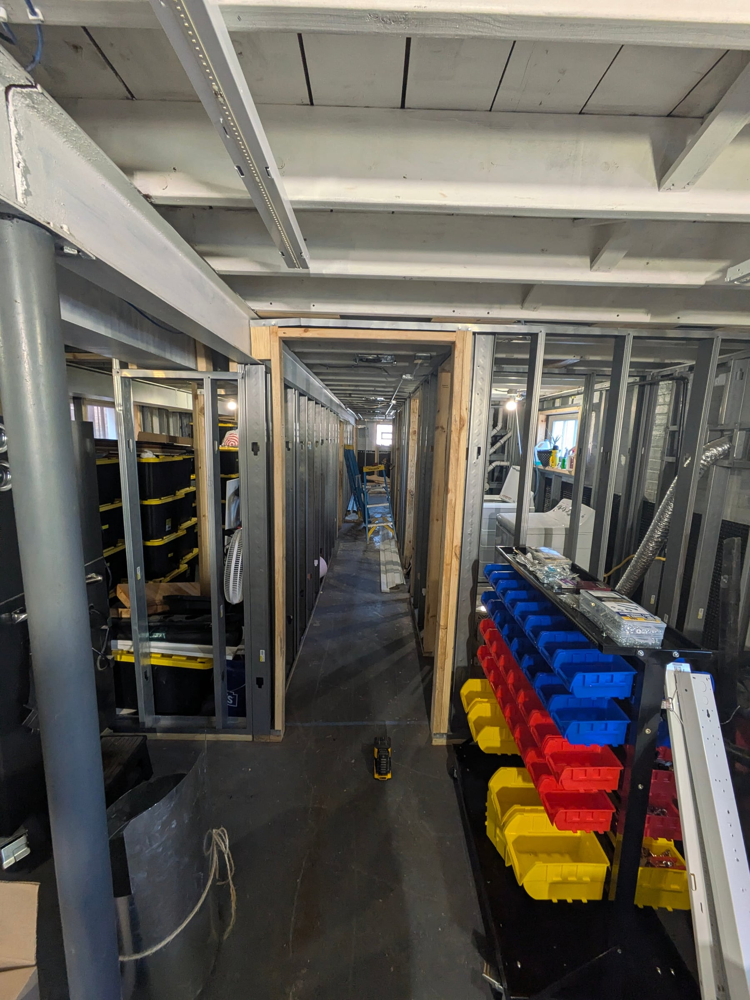
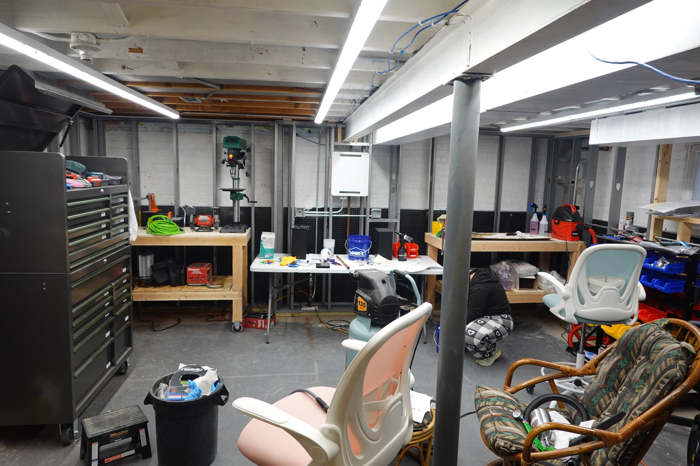
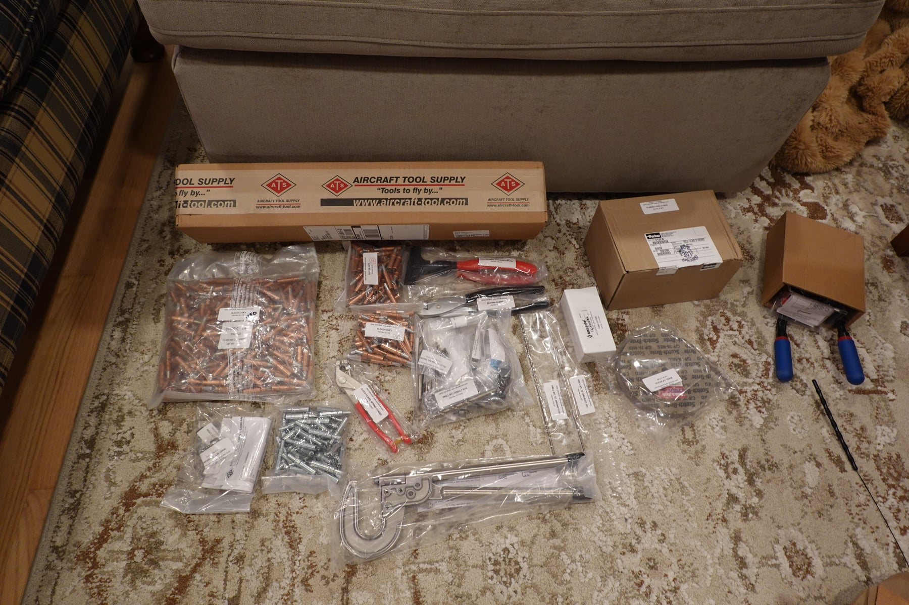
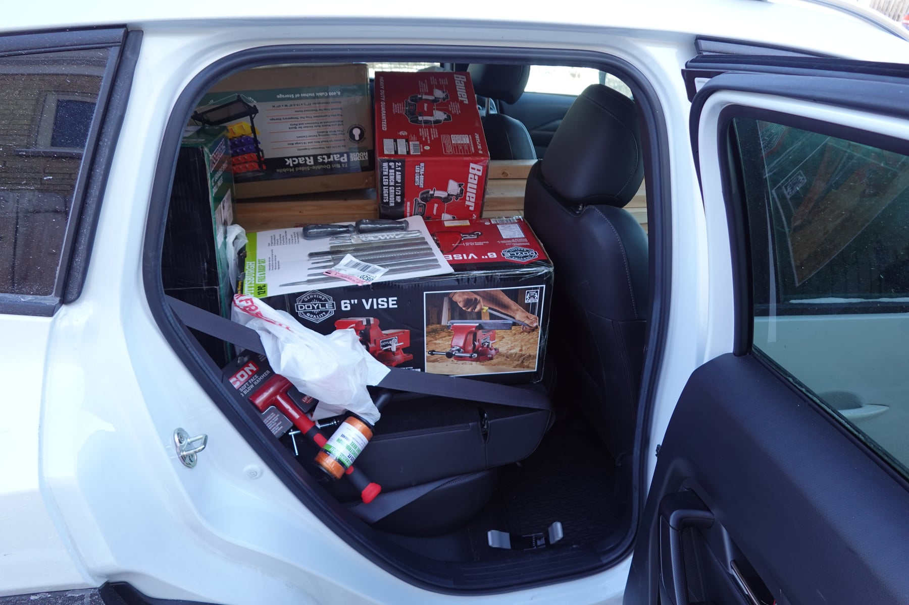
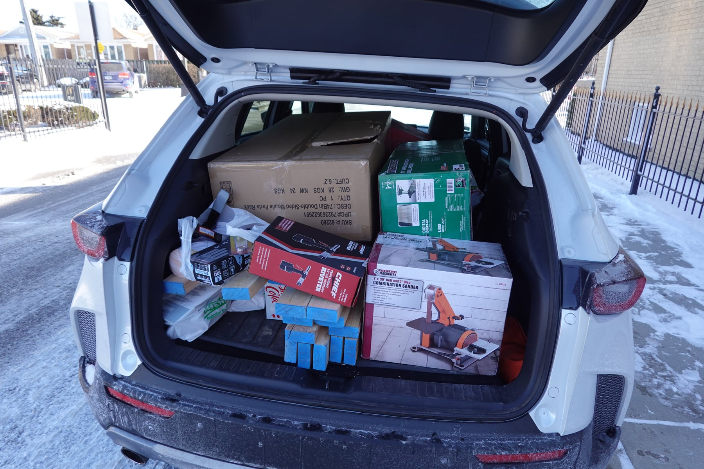
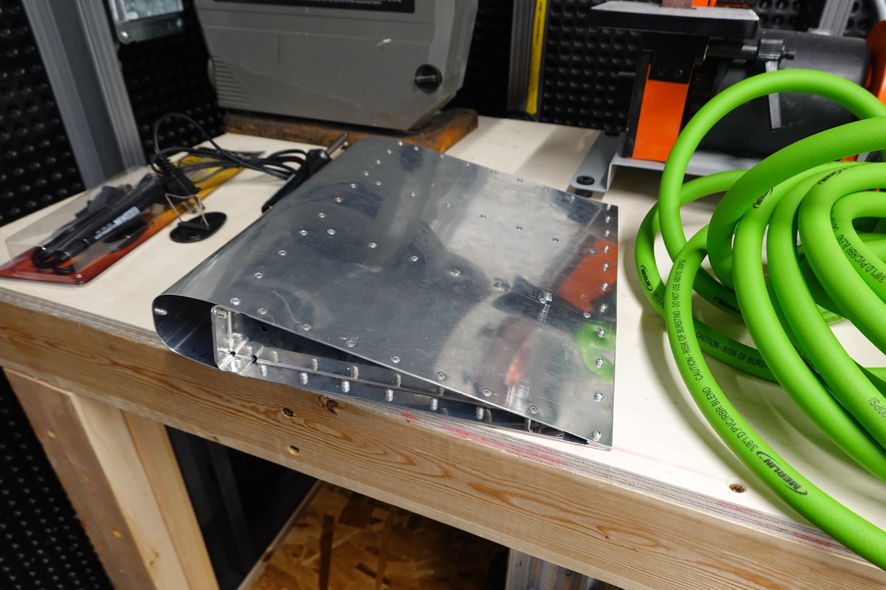
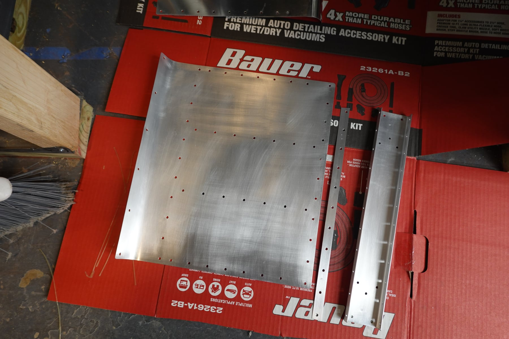
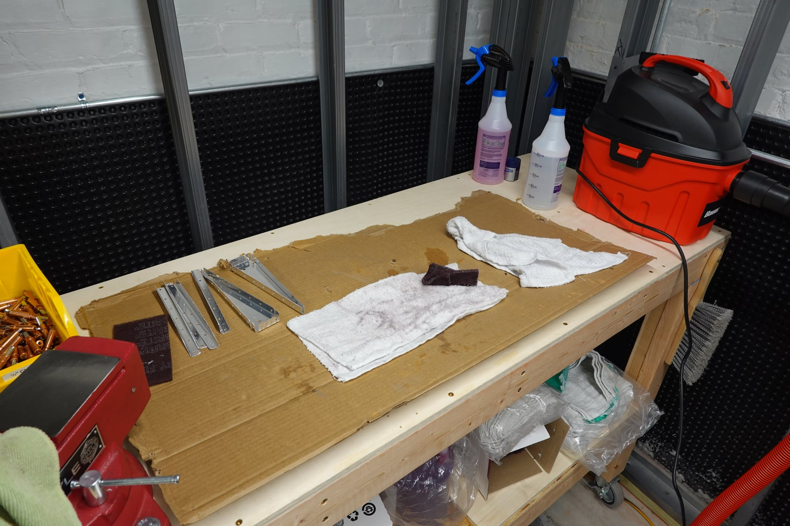
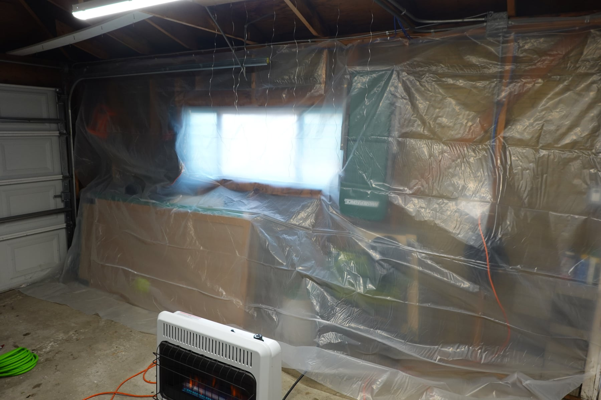

Here's the first post for our RV-12iS #121708 build log. We're going the
E-LSA route, so we don't technically need a build log, but it's a good
record to look back on — and a place to collect opinions we can either
listen to or ignore.

I've wanted to build a plane for a couple of years now, and I was sitting
on the couch one weekend in January when I asked the wife (I'll refer to
her as the YL going forward — it's simpler and I like the amateur radio
term) if she wanted to build a plane. Neither of us has a pilot's license
yet, so it's a bit of an ambitious question. She agreed.

## Choosing the RV-12iS

We did some research on what we wanted to build and explored a bunch of
options. RV-7? Tailwheel with a sliding canopy and super fast! RV-10?
Super spacious and fast! Sling TSi? Of course those are cool planes, but
they're not good trainers and involve a lot of decisions for people who
have spent less than an hour in a GA plane. Eventually we narrowed it down
to the Sling LSA and RV-12iS. I really liked the Sling LSA, but with the
significantly longer lead times and less domestic builder support, we
ended up choosing the RV-12iS.

So on January 14, four days after we decided to build a plane, we put the
deposit down on the fastener kit, empennage kit, and wing kit. The goal is
to build it quickly. I'm sure that's what everyone says, but we have free
time to dedicate to it — hoping the two of us can put in at least 25 hours
each a week. We'll see how realistic this becomes by the time we're
finished. Because of the planned speed, we're ordering kit parts fast. In
early February we also put the deposit down on the fuselage kit and
avionics kit (we're going with the Garmin IFR setup). Powerplant and
finishing kit deposits come in a couple of weeks. The timing could work
out to finish in January 2027 at the earliest. It will probably go longer
than that.

## Learning to fly

Now you might be thinking: they don't know how to fly. Well, we're working
on that. We found a semi-local flight school with RV-12s, and I did 4
lessons and the YL did 2. Now we're switching to a very local school to
get our tickets. The YL is going the sport pilot route and I'll start with
my PPL, with the goal to go further down the track later. Hopefully we'll
be done and ready to fly the plane once it's built. What will we use it
for? I'd like to train to CFII eventually, she's interested in CFI-S, and
we'll do weekend local trips and longer XC trips to visit family.

## Workshop

We're in the process of having our basement remodeled. It's 980 sqft and
was previously empty. It's being finished with a bathroom, bedroom,
laundry room, mechanical room, and most importantly a 300 sqft workshop.
It won't be big enough to hold an entire plane — we'll eventually have to
move to the garage — but it's a great place to prep parts and assemble
smaller structures. Yes, that means we're starting a plane build while the
basement is under construction. There's a lot of downtime in construction
while waiting for inspections, so it's not that crowded down there most of
the time.

## Priming

The garage will be for priming. We want to prime the entire interior of
the plane — if we're spending this much money, we want it to last. We
decided on Stewart Systems EkoPoxy in ZC Green, because we both feel like
plane primer should be green. Since it's cold outside, we bought a
Mr. Heater 30k BTU indoor propane heater. The plan: plastic sheeting for a
paint wall in the garage, heat the garage to the primer's minimum temp,
turn off the heater, vent using the man door and garage door, spray, then
bring the parts inside to cure for a day or two. I bought a CO detector
and will monitor temperature and humidity. This is only temporary until
spring arrives, but right now there's snow on the ground.

## Costs

I keep a spreadsheet of everything we've purchased plane-related — tools,
the plane itself, all of it. Estimating the cost of a kit build is
difficult, so I want to share exact numbers as much as possible. To date
we're at $4,325.52 in tools/consumables and $33,043.75 on the kit, and
we're expecting about $190,000 for the finished (unpainted) plane. Yes,
that's a lot in tools, but we bought everything on the tool list plus some
essentials for the upgraded workshop. We could have gone cheaper. Most
tools came from Harbor Freight, Menards, and Aircraft Tool Supply.

## Practice kits

We bought two practice kits from Vans and spent a lot of time learning on
them. We also watched the Metal Magic series on the Kitplanes Magazine
YouTube channel, which was very helpful. We've practiced cutting,
deburring, drilling, cleaning, etching, priming, riveting. I definitely
suggest the practice kits. The first time doing a task, it feels
overwhelming and impossible. The second time it feels manageable. Way
better to mess up on these than the actual airplane.

## EAA and community

We reached out to a local EAA Technical Counselor and had breakfast with
him at the airport. He'll be over once the empennage arrives to give us
feedback on our initial work, and he seems genuinely interested in being
involved. One of the reasons we want to get into aviation is to meet
people and build our social circle. We're going to an EAA chapter soup
potluck and our first chapter meeting soon. We've already met a ton of
great people in the month and a half since we decided to build an
airplane.

## Building as a team

The YL is helping build. On the practice kit she's way better than I am at
deburring, and she enjoys the cleaning, etching, and priming process. I
like the building, and clecos are fun (for now — I'm sure I'll get sick of
them). We'll make a good team. We've also picked out a tail number and
have it reserved: N1798, which has personal meaning for the YL.

## What's next

The first kit arrived in our city today and is scheduled to be delivered
Thursday. We have a couple of things left to figure out (like spraying the
primer — our first attempt was awful, much like our first attempt at
everything thus far). We'll inventory the parts, figure out where to put
them in the construction zone that is our house, and start on the
empennage. The wings aren't scheduled to arrive until the end of May, so
we have almost three months to get comfortable before the bigger pieces
show up.

## Photos

