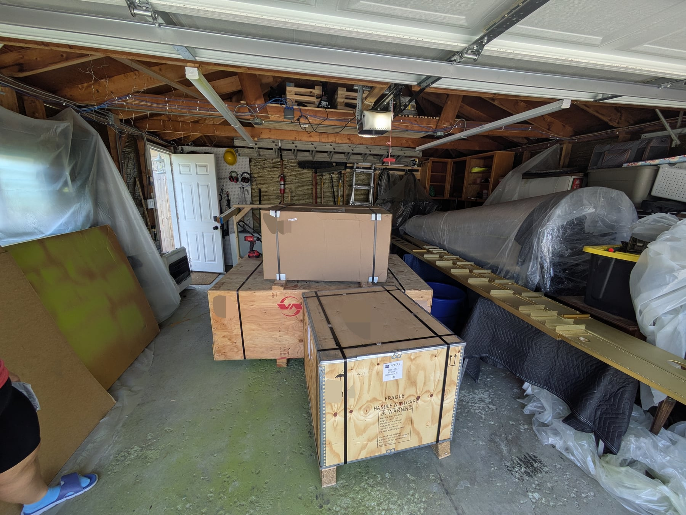
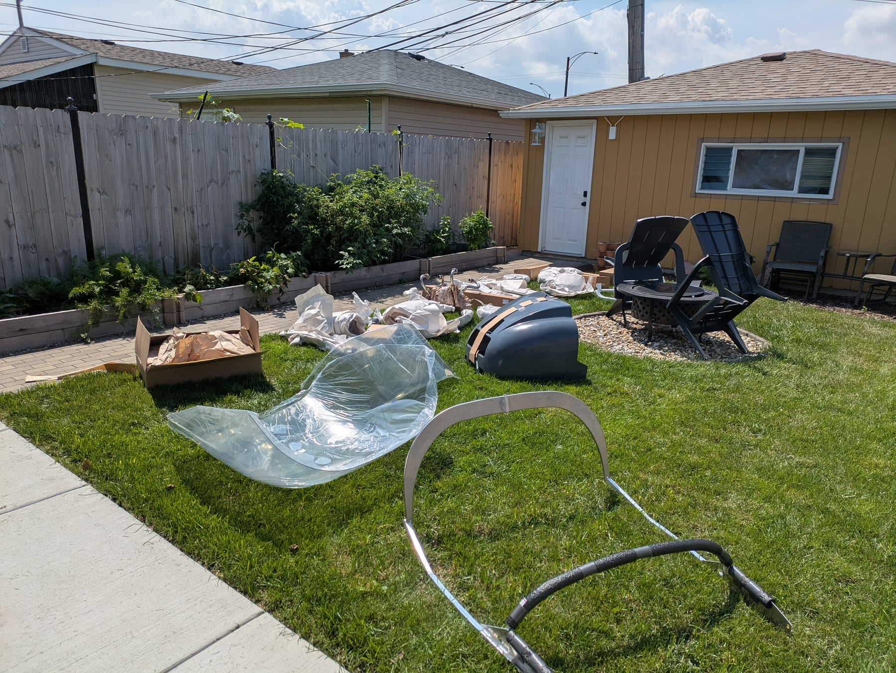
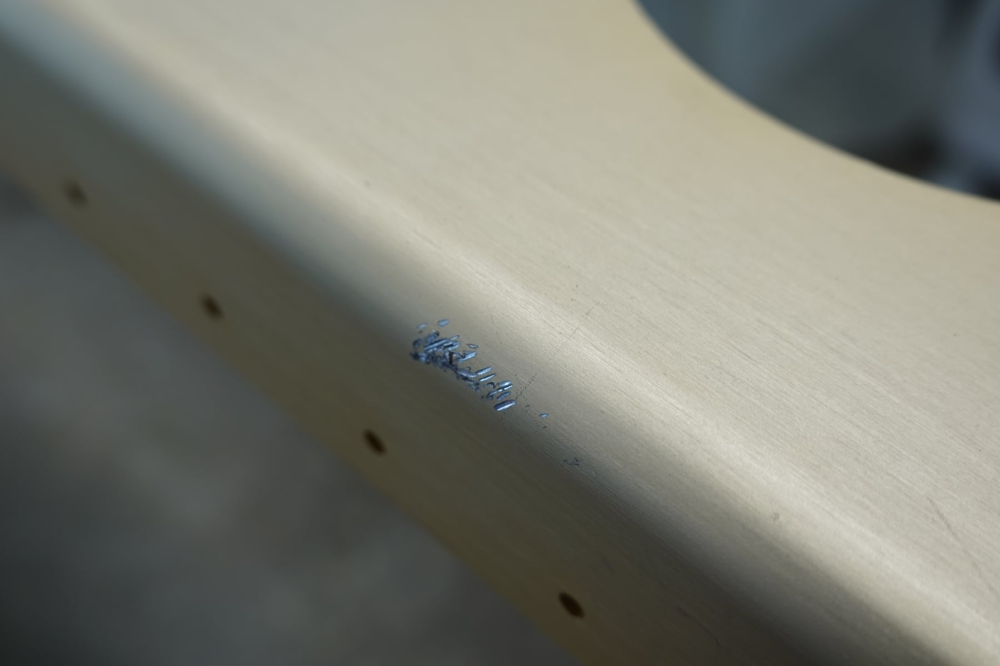
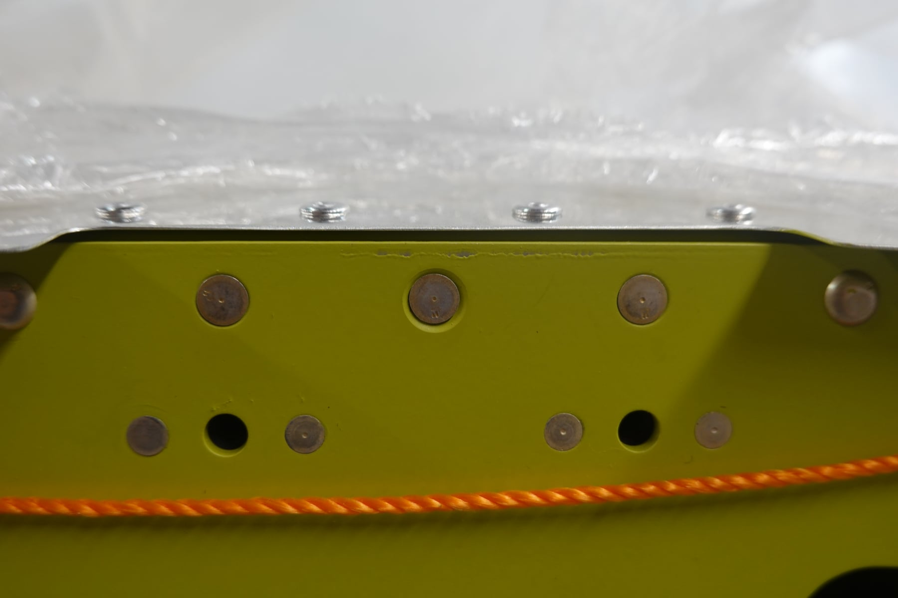
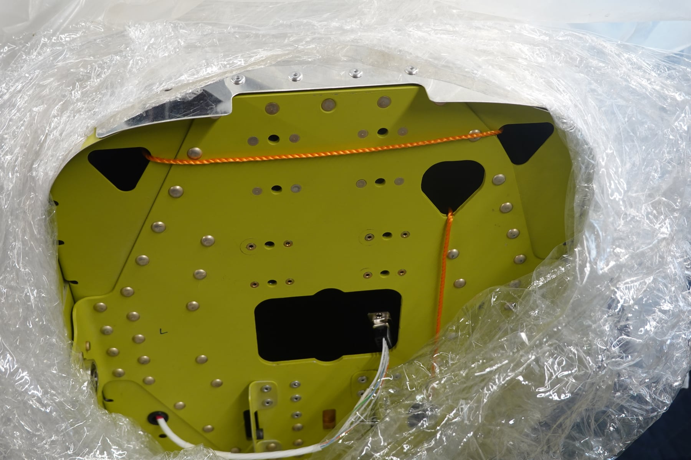
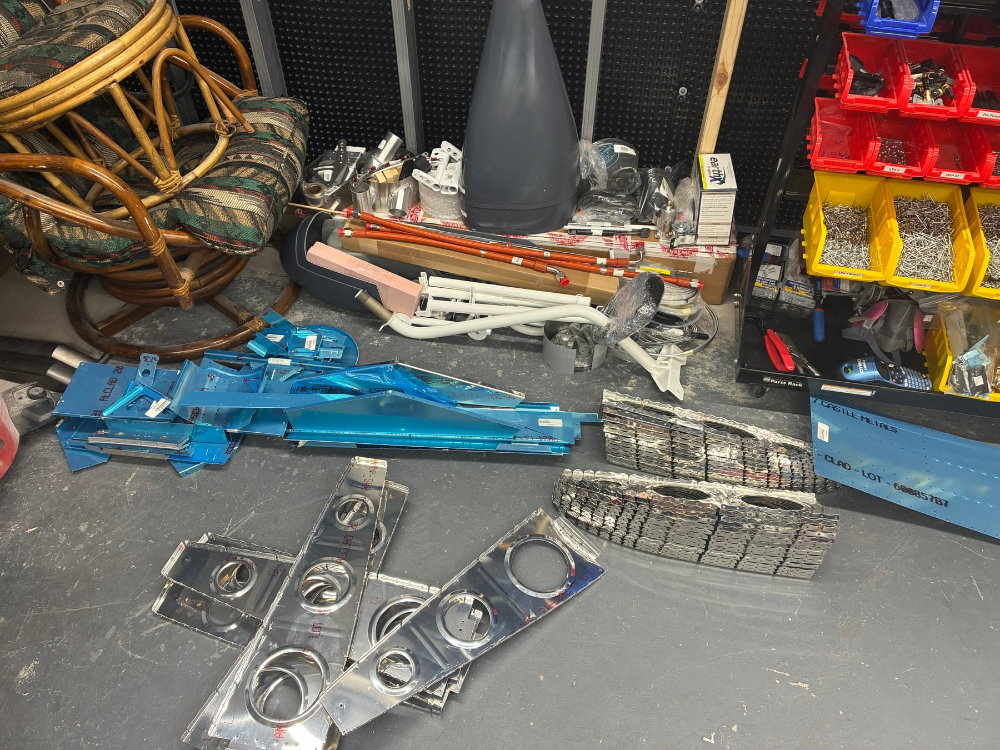
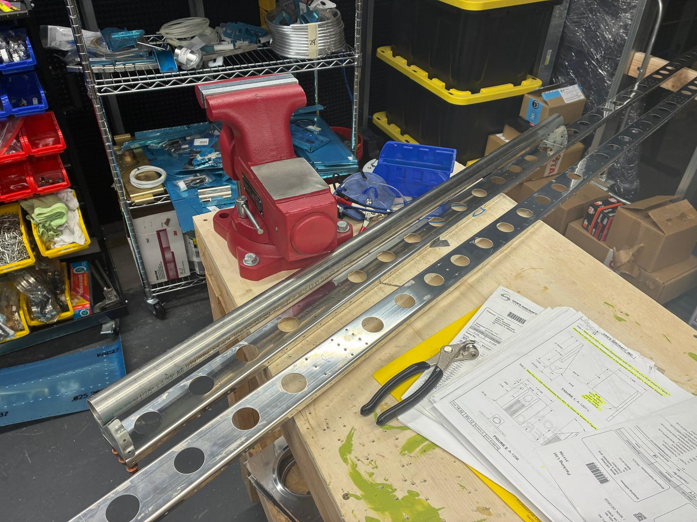
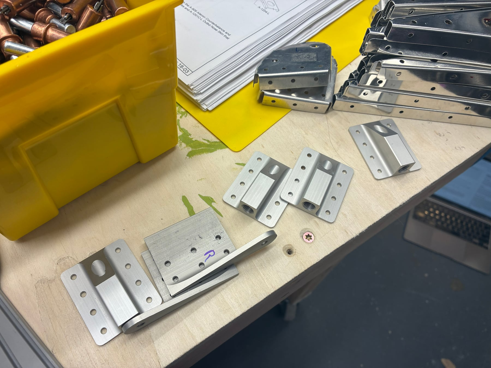
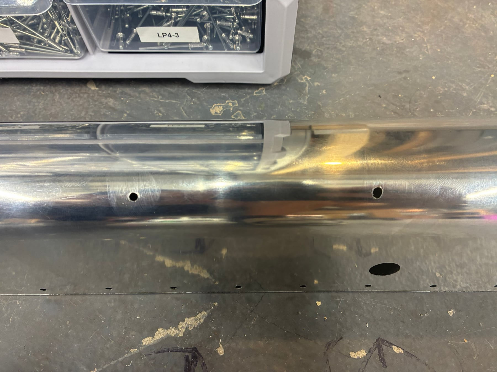

## Kit arrivals

The finishing kit and powerplant kit have both arrived. I'm running out of
places to store things. There are airplane parts in the garage, the
basement, the coat closet, and at this point I'm looking for more closet
space throughout the house. I guess as it becomes an assembled airplane it
will actually take up less space, not more.

## Avionics

I've reached out to Vans about the possibility of upgrading my G3X Touch
avionics order to AXIS, since S-LSA orders are now getting that option.
They're checking with the team. No answer yet, but I'm hopeful. The
avionics are scheduled to ship September 8th, so there's still a bit of
time. Worst case it will be the G3X, which is still great, of course.

## Open items with Vans

I also emailed Vans about two items I need disposition on. First, the three
AN426AD4 rivets on the F-1211B bulkhead doubler that I countersunk at 120
degrees instead of 100. The left and right look okay; the middle one is
over-countersunk and not great. Second, a scratch on the left wing main
spar that I'm not sure came from shipping or handling. I've sent
measurements and photos for both and am waiting for their response. Neither
is a blocker right now, but definitely things I need input on.

## LSRM

Shelby and I are in the middle of the Joby Aviation LSRM online course.
It's taking up a good chunk of our evenings, with the in-person wrench week
in California coming up in September. This has been taking up a lot of our
time and we'll both be happy when it's over.

## Wing progress

We've been working through all the wing rib modifications and deburring. We
also have a third set of hands. A 16-year-old Hungarian exchange student
staying with us this year has been helping with deburring. Three people
deburring is definitely better than two, and she's learning a lot so far.

## More replacement parts

Two more pieces ordered this round. The W-1208-L-1 nose rib, because when I
was removing the forward flange on the sander I hit another flange. It's
probably fine, but I wasn't completely happy with it.

The A-1201C-L aileron outboard nose skin needs replacing because the
instructions call for match drilling #30 into the aileron counterbalance.
What they should tell you is to first match drill #40 and then enlarge to
#30. If you go straight in with a #30 bit, you're going to enlarge the
holes. I did three of them before I realized it was going badly, figured
out the right technique, and decided to just replace the skin since the
holes looked terrible. Another tip for future builders.

That's another $112.69 in replacement parts. The $15 flat rate shipping
every time continues to sting.

## Lessons learned

I think I'll make a specific post at some point with all of the lessons
learned as a single page, so that hopefully others can avoid the mistakes
I'm making. We're probably a bit eager to replace pieces, but we're trying
to find that sweet spot between accepting bad quality and perfectionism.
I'm sure we'll never find it.

## What's next

Shelby and I are going to try to spend at least an hour a night on the
plane. I think once we finish the LSRM course we'll spend more than that.
We're motivated and excited, but deburring ribs isn't too exciting!

## Hours

Wings are at 9.5 for me, 8.5 for Shelby, and 1 hour for our exchange
student. Not that much progress for having had the kit for two months.

## Photos

