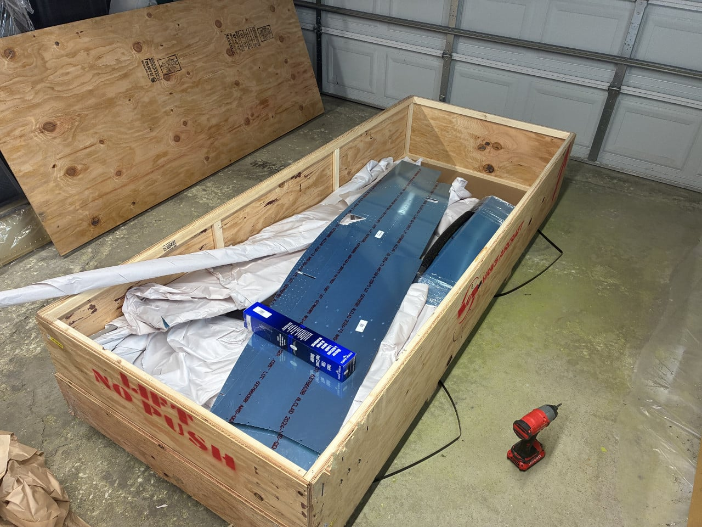
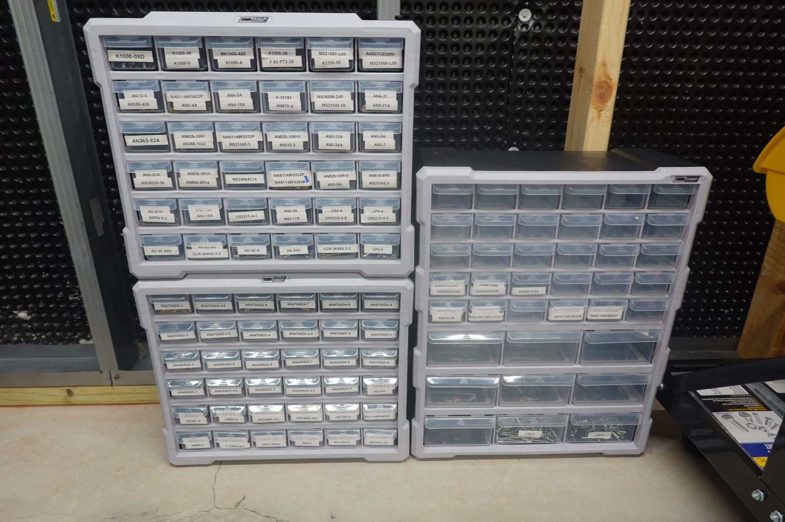
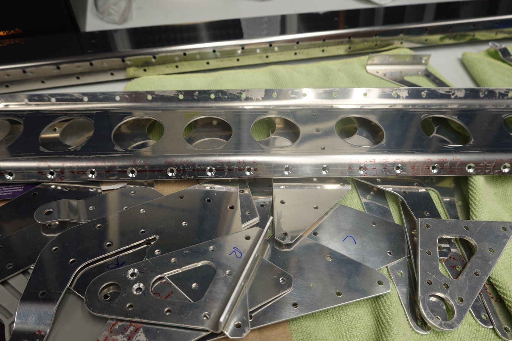
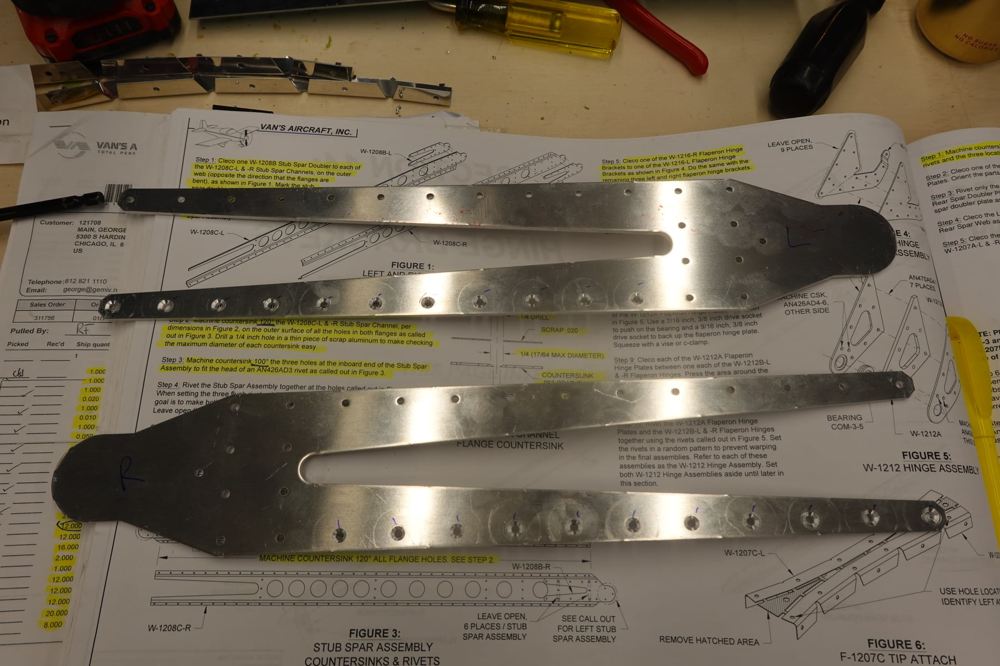

A longer update today. Not a ton of build progress, but a lot of setup
work and some lessons learned that might save a future builder some
headaches.

## Fuselage delivery

The fuselage was delivered! Inventory took a while since I was by myself
and there are significantly more pieces than the empennage or wings. A
couple of pieces were missing, and the WD-1204-PC engine mount bracket and
F-01276-1 bottom skin are on backorder. Vans quickly sent over the missing
pieces and one small skin that was damaged in shipping.

I was considering building the fuselage before the wings, since I'm not
sure where I'll store completed wings, but with the bottom skin on
backorder and required for starting the fuselage, we decided to start the
wings instead.

## Fastener organization

I finally re-organized all of the fasteners. I bought some organizers from
Menards, counted everything, labeled all the drawers, and split up the
bags of small parts. I should have done this sooner. It will make finding
the right fastener so much easier.

## Wings started

On July 26th we started on the wings. We immediately ran into an issue:
the W-1210B rib doublers are missing. We had them at inventory, but since
the wing kit was delivered back in May, they've gone missing somewhere in
the house. We looked everywhere. We'll probably end up buying
replacements, but we're holding off in case we need to order anything
else so we can combine shipping. The $25 minimum shipping adds up.

## Countersink mistake on the F-1211B bulkhead doubler

Here's a mistake I want to call out for future builders. Back on the
empennage, I countersunk three AN426AD4 rivets on the F-1211B bulkhead
doubler at 120 degrees instead of the correct 100. It was my first time
countersinking a #30 hole, and I didn't realize I had bought both 120 and
100 degree #30 countersinks. I grabbed the wrong one and didn't realize
until later, on the spar, that I had both.

I'm going to email Vans for a proper disposition. It's a discrete piece
that doesn't need resolving right now, but I want their take on what
remediation is needed, if any.

Tip for future builders: there are two #30 countersinks in your toolbox
(120 and 100 degree). Use the right one, and mark in the plans which one
you used each time in case you doubt yourself later.

## Rear spar confusion (page 14-03)

The next confusing part was the rear spar doubler. It took a while to
figure out exactly what Vans wanted here. Thanks to a fellow builder's
blog with very clear pictures of this area, I could finally interpret the
instructions.

I sent Vans a builder feedback form with suggestions: the instructions
should note that CS4-4 rivets require a 120 degree countersink (the first
time this comes up for this purpose, and it's easy to miss); steps 1 and 2
on page 14-03 should probably be swapped, since you need to cleco the
hinge assembly before countersinking; the countersink cage doesn't fit
well in the tight space around the hinge assembly; the "aft" callout needs
clearer marking on the figure; and the arrows on figure 2 are confusing
since they point to different things on top versus bottom. Overall the
page could use some additional notes.

## Rib prep

I've been prepping all the pieces from sections 13, 14, and 15. The goal
is to prep as much as possible of the spars, hinges, brackets, and ribs,
then deburr everything and prime in one big batch so all that's left is
assembly.

One thing that was new on the wings: there are a few places, mostly on the
hinges and doublers, that require countersinking both sides of a squeezed
rivet hole so both the shop and factory head sit flush. Weird and
unintuitive at first.

I've started on the rib modifications, and honestly the whole wing is
going faster than expected. It feels like we're in a groove after building
the empennage. I'm sure things will slow down when we're deburring 50+
ribs and priming them all, but for now the dry-fitting stage is moving
along well. Maybe I'm just being naive. We'll see.

11 combined hours on the wings so far.

## Photos

